

<h1 align="center"> 《PyTorch深度学习实践》笔记</h1>

  	
  
  
   	
  	
    
     

  <a href="#项目动机">项目动机</a>/
  <a href="#项目简介">项目简介</a>/
  <a href="#参考资源">参考资源</a>/
  <a href="#目录">目录</a>/
  <a href="#文件夹说明">文件夹说明</a>/
  <a href="#组织者">组织者</a>/
  <a href="#贡献者">贡献者</a>

---

## 项目动机

《PyTorch深度学习实践》课程是由[**刘洪普老师**](https://liuii.github.io/)(河北工业大学人工智能与数据科学学院教师)所讲授的PyTorch实践课程，在深度学习初学者中广泛流传。本项目总结了此课程的学习笔记，我们将所有的笔记开源，在自己学习的同时，希望也能帮助到他人，方便大家快速学习PyTorch入门以及复习回顾。

>本项目的特色：
>1. 笔记与原课程视频对应，方便大家快速学习理解。
>2. 笔记包含代码样例，帮助大家快速上手实践。

课程视频共13节，单个视频平均时长不超过60分钟，预计一周可以学习完毕。
由于我们的水平有限，如有错误与疏漏，还望谅解，有任何问题欢迎随时指出，我们会进行更正，谢谢大家。     
本项目所用徽章来自互联网，如侵犯了您的图片版权请联系我们删除，谢谢。

## 课程简介

PyTorch是一个基于Torch的Python的开源机器学习框架，其具有强大的张量计算GPU加速、可以实现包含自动求导系统的神经网络搭建等功能。其代码简洁直观、易于理解，目前PyTorch框架在学术以及工业界得到了广泛应用，备受机器学习研究者的青睐。

## 参考资源

- B站课程视频：[深度学习实践](https://www.bilibili.com/video/BV1Y7411d7Ys)
- 课程主页：[深度学习实践](https://liuii.github.io/post/pytorch-tutorials/)
- PyTorch官方教程：[PyTorch Tutorial](https://pytorch.org/tutorials/)

## 笔记

| 章节| 视频  | 笔记   |
| ---- | ------------------------------------------------------------ | ------------------------------------------------------------ |------------------------------------------------------------ |
| 1.引言  | <a href="https://www.bilibili.com/video/BV1Y7411d7Ys?p=1">  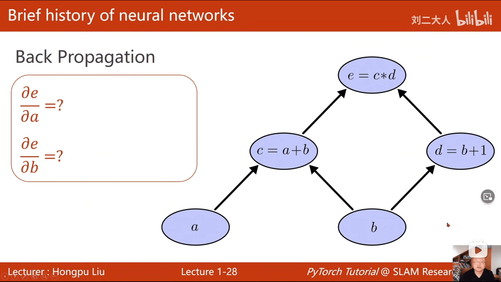</a> | [计算图](./notes/00_%E8%AE%A1%E7%AE%97%E5%9B%BE.md) |
|  2.线性模型     | <a href="https://www.bilibili.com/video/BV1Y7411d7Ys?p=2">  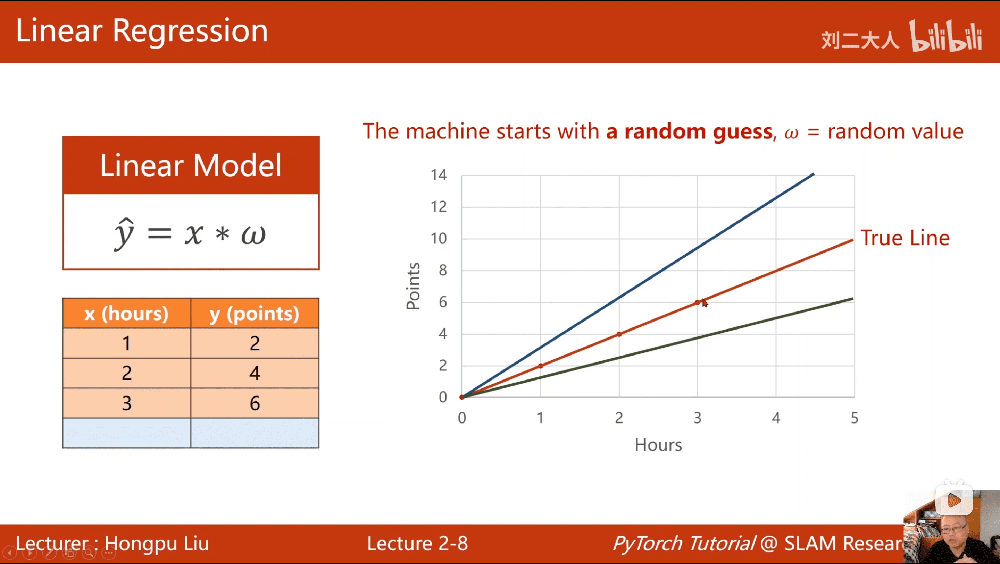</a>   |  |
| 3.梯度下降法  | <a href="https://www.bilibili.com/video/BV1Y7411d7Ys?p=3">  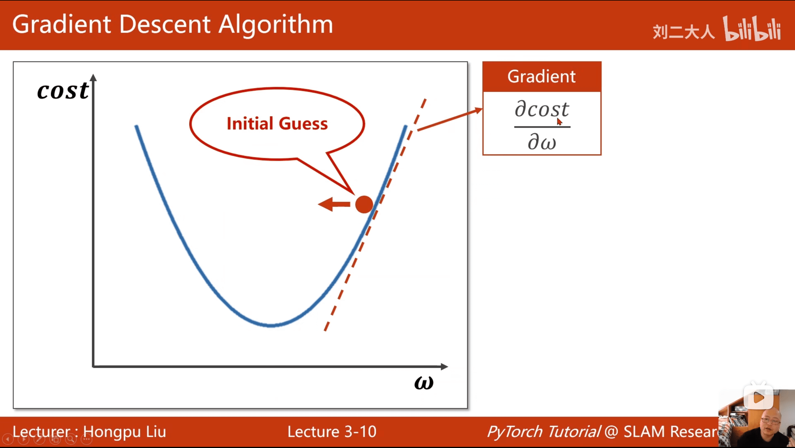</a> | [梯度下降法](./notes/03_梯度下降法.md)|
| 4.反向传播   | <a href="https://www.bilibili.com/video/BV1Y7411d7Ys?p=4">  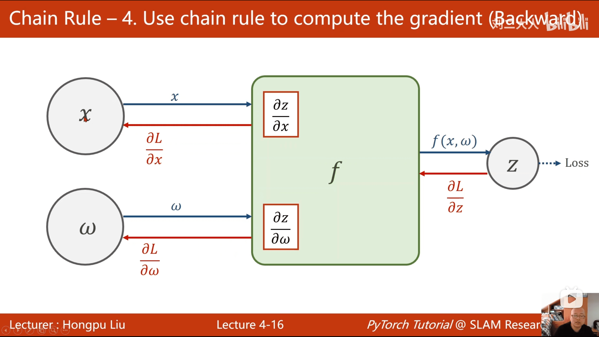</a> | |
| 5.Pytorch实现线性回归   |<a href="https://www.bilibili.com/video/BV1Y7411d7Ys?p=5">  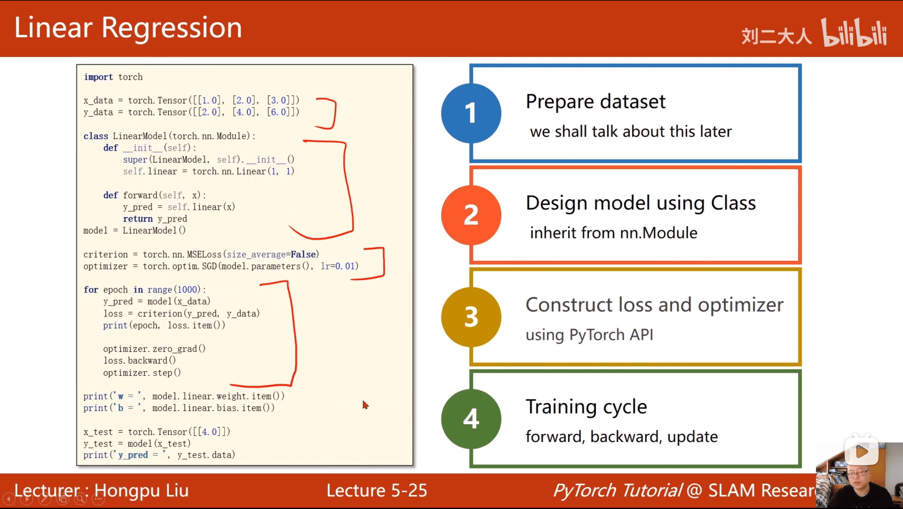</a>  | [PyTorch实现线性回归](./notes/05_线性回归.md) |
| 6.逻辑斯蒂回归 | <a href="https://www.bilibili.com/video/BV1Y7411d7Ys?p=6">  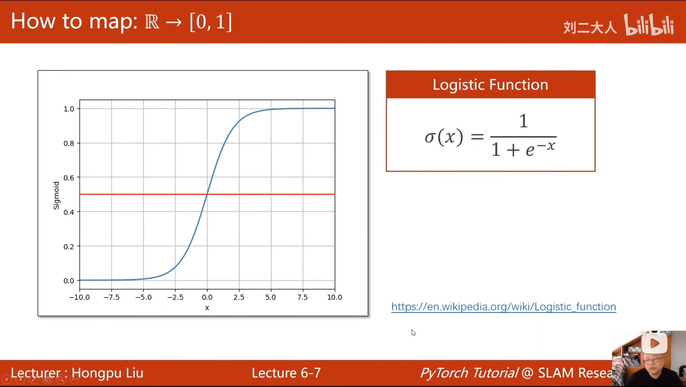</a>  | [逻辑斯蒂回归](./notes/06_逻辑斯蒂回归.md) |
| 7.处理多维特征的输入   | <a href="https://www.bilibili.com/video/BV1Y7411d7Ys?p=7">  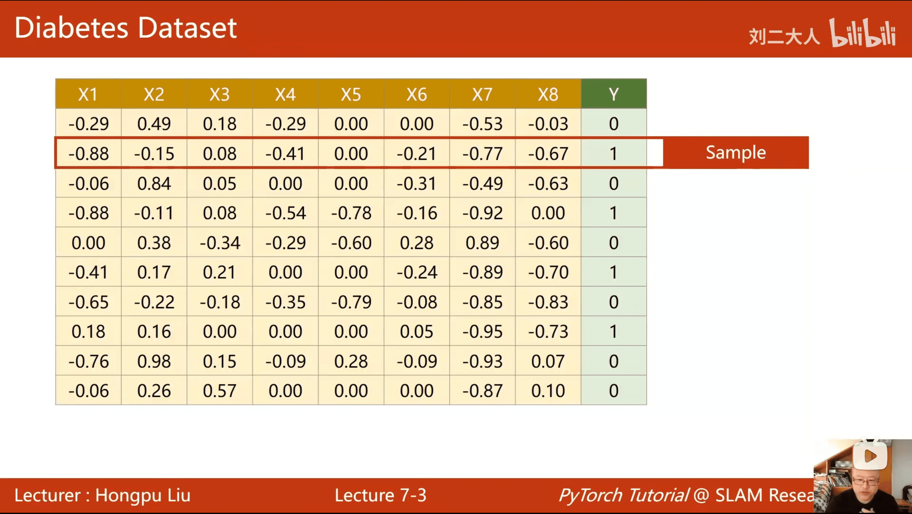</a>  | | 
| 8.加载数据集   | <a href="https://www.bilibili.com/video/BV1Y7411d7Ys?p=8">  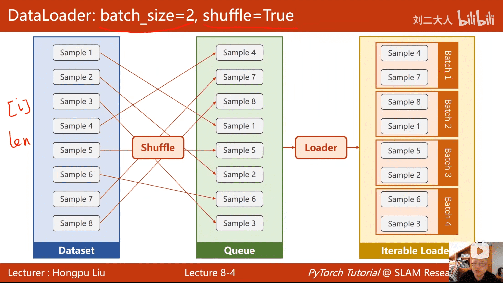</a>  |  [加载数据集](./notes/08_加载数据集.md) |
| 9.多分类问题 |<a href="https://www.bilibili.com/video/BV1Y7411d7Ys?p=9">  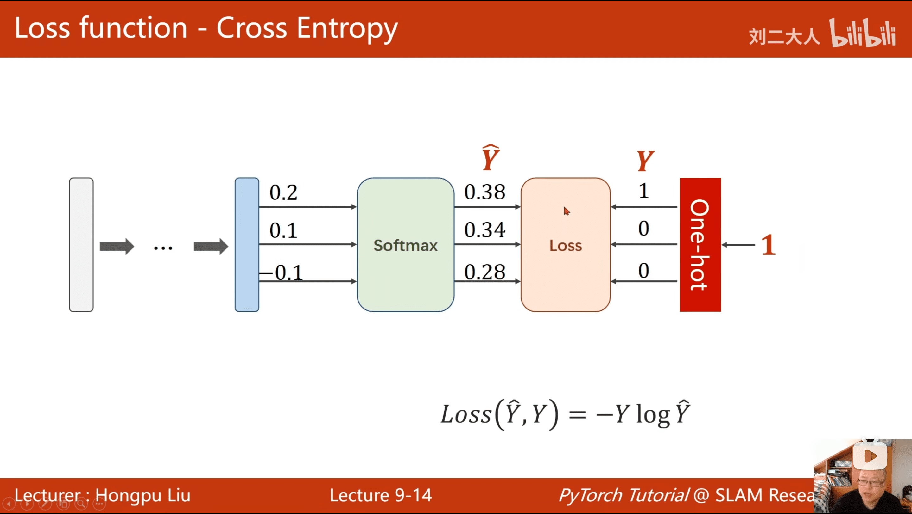</a>|[多分类问题](./notes/09_多分类问题.md)|
|10.卷积神经网络（基础篇）|<a href="https://www.bilibili.com/video/BV1Y7411d7Ys?p=10">  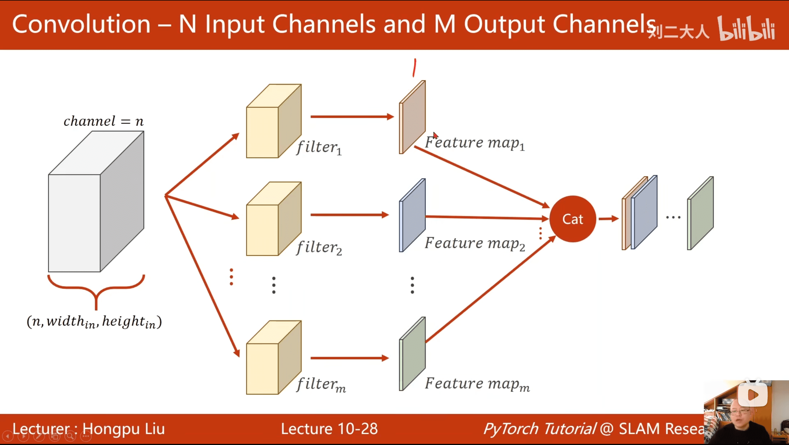</a>|[卷积神经网络（基础篇）](./notes/10_卷积神经网络.md)|
|11.卷积神经网络（高级篇）|<a href="https://www.bilibili.com/video/BV1Y7411d7Ys?p=11">  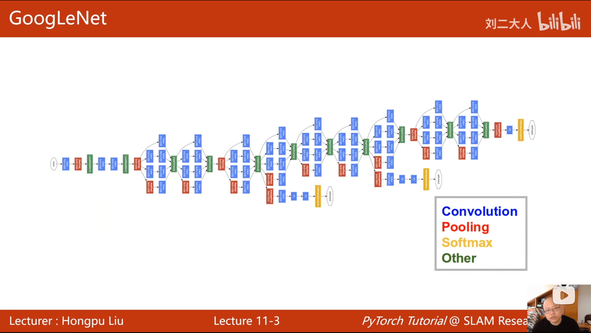</a>|[卷积神经网络（高级篇）](./notes/11_卷积神经网络(高级).md)|
|12.循环神经网络（基础篇）|<a href="https://www.bilibili.com/video/BV1Y7411d7Ys?p=12">  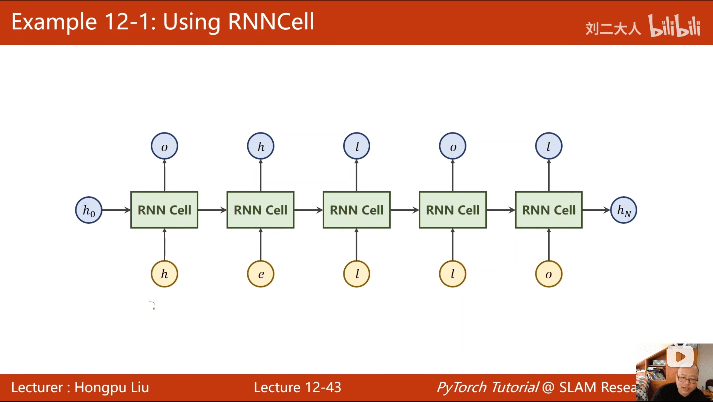</a>|[循环神经网络（基础篇）](./notes/12_循环神经网络.md)|
|13.循环神经网络（高级篇）|<a href="https://www.bilibili.com/video/BV1Y7411d7Ys?p=13">  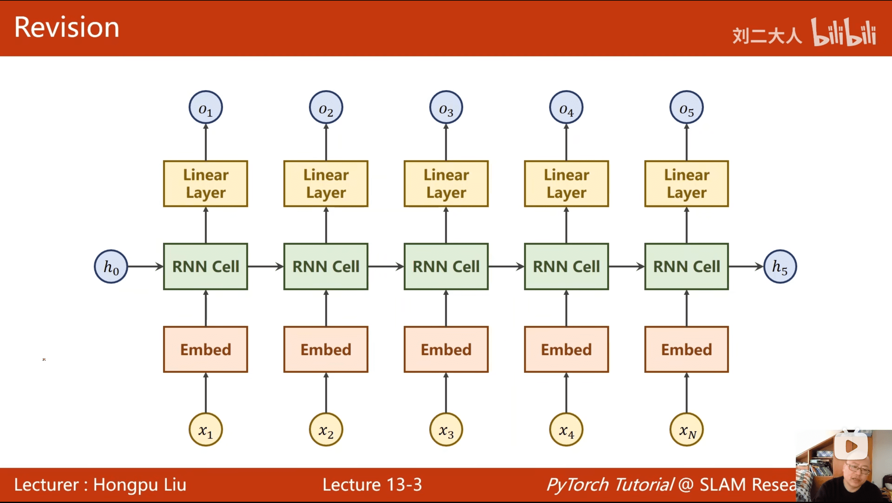</a>|[循环神经网络（高级篇）](./notes/13_循环神经网络(高级).md)|

## 文件夹说明

- **notes**: 笔记
- **imgs**：项目中的图片

## 组织者
感谢以下同学对本项目的组织

## 贡献者
感谢以下同学对本项目的支持与贡献

