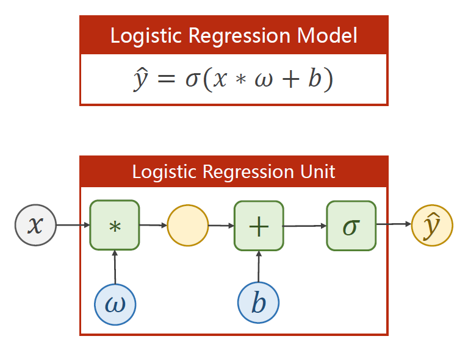
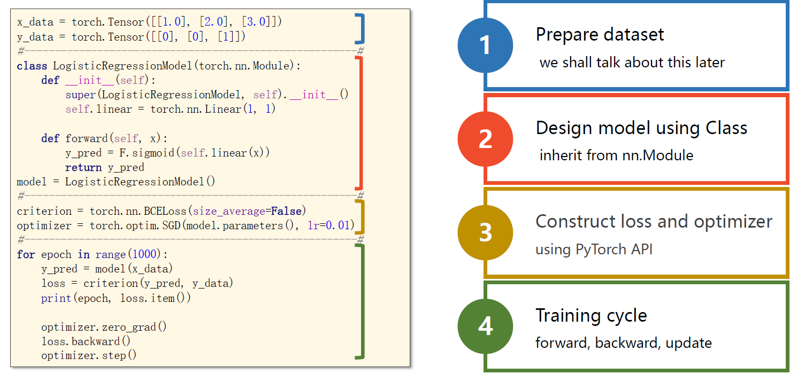

# Logistic回归
## 代码示例1

 代码功能：演示python中通过 *args 和 **kwargs 来接受参数 以及 类的 \_\_call\_\_方法

```python
class Foobar:
    def __init__(self):
        pass

    def __call__(self, *args, **kwargs):
        print(args)   # (1, 2, 3)
        print(kwargs) # {'x': 4, 'y': 5}

foobar = Foobar()
foobar(1,2,3,x=4,y=5)
```

## 代码示例2

代码功能：使用pytorch.nn.Linear实现线性回归

```python
import torch

# 模拟训练集，这里 y = 2x
x_train = torch.Tensor([[1], [2], [3]]) # 这是一个 (m,1) 的矩阵，数据集数量在第0维
y_train = torch.Tensor([[2], [4], [6]])

model = torch.nn.Linear(1, 1)
criterion = torch.nn.MSELoss()
optimizer = torch.optim.SGD(model.parameters(), lr=0.01)

for epoch in range(10000):
    y_pred = model(x_train) # 注意这里不是调用model.forward(x_train)
    loss = criterion(y_pred,y_train)
    print(epoch,loss)

    optimizer.zero_grad() # 清空之前的动量
    loss.backward()  # 反向传播计算梯度
    optimizer.step() # 利用计算好的梯度更新参数

print("w =",model.weight.item()) # w = 1.9999957084655762
print("b =",model.bias.item())   # b = 8.701974365976639e-06

# 测试集
x_test = torch.Tensor([4])
y_test = model(x_test)
print("y_pred =",y_test) # y_pred = tensor([8.0000], grad_fn=<AddBackward0>)
```

## 代码示例3

代码功能：使用pytorch实现 logistic 回归

* import torch.nn.functional as F
* 也可以通过 torch.sigmoid(z) 进行调用
* 但是更好的做法是 self.activate = torch.nn.Sigmoid()，之后通过 self.activate(x) 的方式来激活
  * 这样做的好处是以后如果要更换激活函数，就只要改一行代码就够了



