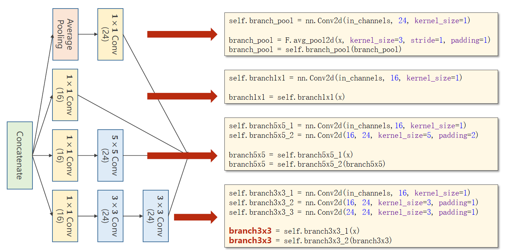
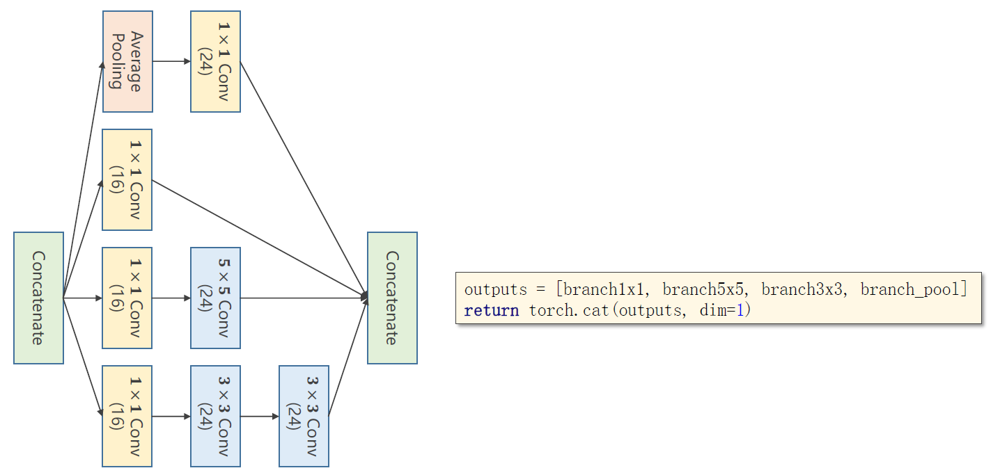
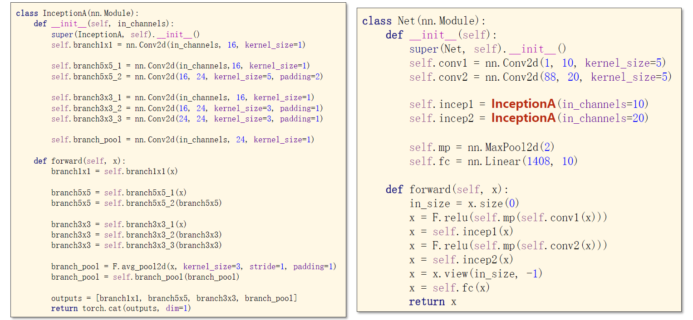
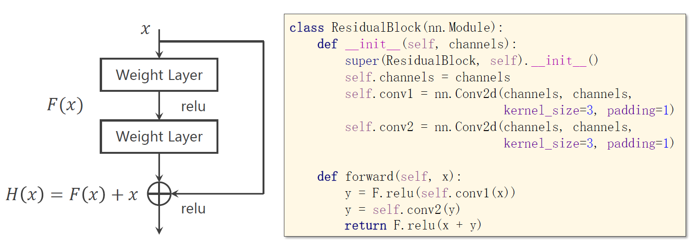
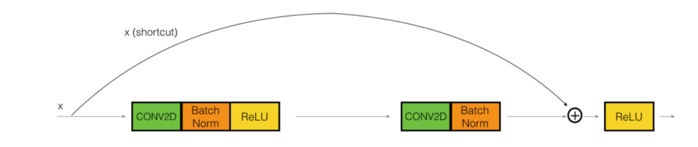
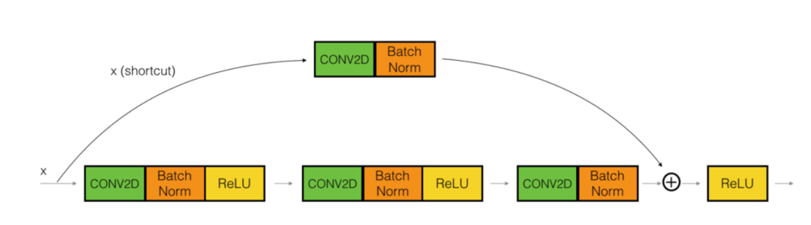

# 卷积神经网络-高级

## 代码示例1

代码功能：实现了上图中的 Inception Module





* 最后的线性单元的输入是1408维的，来源如下：
  * 通道变化过程：10 ==> 88 ==> 20 ==> 88 ==> 展开得到输入为1408维的向量。其中，1408 = 4\*4\*88，4\*4是最终输出的图像的宽和高。
  * 注意这里使用的 mnist 数据集。
  * 注意这里 Net 模块中 forward 方法中的 view 的用法，in_size 是输入数据集的规模，通过保留规模，自动算出展开后应有的维数。实践中不需要自己去算，就把 init 中最后几行代码略去，然后在 forward 中把维数输出出来看一眼就行了。



## 代码示例2

代码功能：基于 ResNet 的 mnist 数据集训练

* skip over 2层的 identity block，也可以加上 NormBatch
* 实现时，可以在每一步检查一下输出的张量的 size 是否和期望的一样







```python
import torch
import torchvision
import numpy as np
import matplotlib.pyplot as plt
from torch.utils.data import Dataset
from torch.utils.data import DataLoader

####################### Part1. Prepare Dataset #######################

batch_size = 128

transform = torchvision.transforms.Compose([
    torchvision.transforms.ToTensor(),
    torchvision.transforms.Normalize(0.1307, 0.3081)
])

x_train = torchvision.datasets.MNIST(root="D:/Drafts/mnist", train=True, transform=transform, download=False)
train_loader = DataLoader(x_train, batch_size=batch_size, shuffle=True, num_workers=2)

x_test = torchvision.datasets.MNIST(root="D:/Drafts/mnist", train=False, transform=transform, download=False)
test_loader = DataLoader(x_test, batch_size=batch_size, shuffle=False, num_workers=2)


####################### Part2. Design Model #######################

# 这里实现的其实是一个卷积块，不过实践中也不必太纠结这个
class IdentityBlock(torch.nn.Module):
    def __init__(self, in_channels, out_channels):
        super(IdentityBlock, self).__init__()
        self.conv1 = torch.nn.Conv2d(in_channels, in_channels, kernel_size=3, padding=1)
        self.conv2 = torch.nn.Conv2d(in_channels, out_channels, kernel_size=3, padding=1)
        # 用于统一x和y的通道数，最好不要复用conv2，参数单独训练
        self.conv = torch.nn.Conv2d(in_channels, out_channels, kernel_size=3, padding=1)
        self.activate = torch.nn.ReLU()

    def forward(self, x):
        y = self.activate(self.conv1(x))
        y = self.conv2(y)
        x = self.conv(x)
        return self.activate(x + y)


class MyModule(torch.nn.Module):
    def __init__(self):
        super(MyModule, self).__init__()
        self.r1 = IdentityBlock(1, 10)
        self.p1 = torch.nn.MaxPool2d(2)
        self.r2 = IdentityBlock(10, 20)
        self.p2 = torch.nn.MaxPool2d(2)
        self.fc = torch.nn.Linear(20 * 7 * 7, 10)
        self.activate = torch.nn.ReLU()

    def forward(self, x):
        x = self.r1(x)
        x = self.activate(self.p1(x))
        x = self.r2(x)
        x = self.activate(self.p2(x))
        x = x.view(-1, 20 * 7 * 7)
        x = self.fc(x)
        return x


model = MyModule()

####################### Part3. Construct Loss and Optimizer #######################

criterion = torch.nn.CrossEntropyLoss()
optimizer = torch.optim.Adam(model.parameters(), lr=0.01)


####################### Part4. Train and Test #######################

def train():
    for (inputs, labels) in train_loader:
        y_pred = model(inputs)
        loss = criterion(y_pred, labels)
        optimizer.zero_grad()
        loss.backward()
        optimizer.step()

def test():
    correct = 0
    total = 0
    with torch.no_grad():
        for (inputs, labels) in test_loader:
            y_pred = model(inputs)
            _, outputs = torch.max(y_pred, dim=1)

            total += labels.size(0)
            correct += (outputs == labels).sum().item()

    print("test accuracy:", correct / total)


if __name__ == "__main__":
    for epoch in range(10):
        print("<----- %d ----->" % epoch)
        train()
        test() # 最终的准确率大致是98%
```