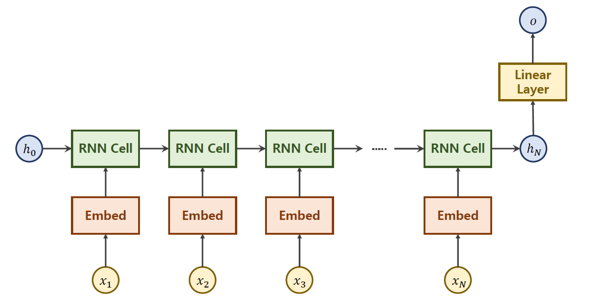
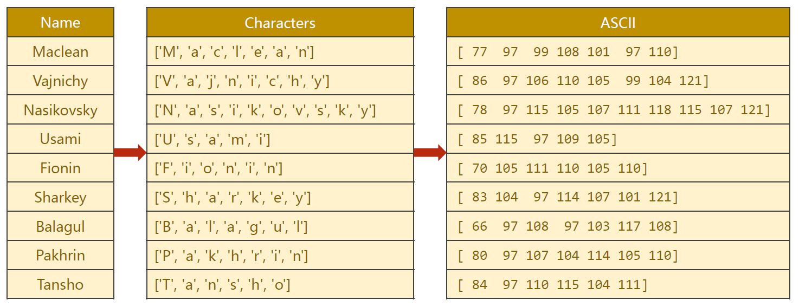
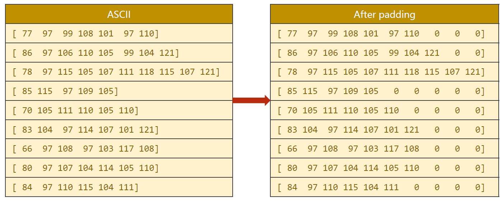
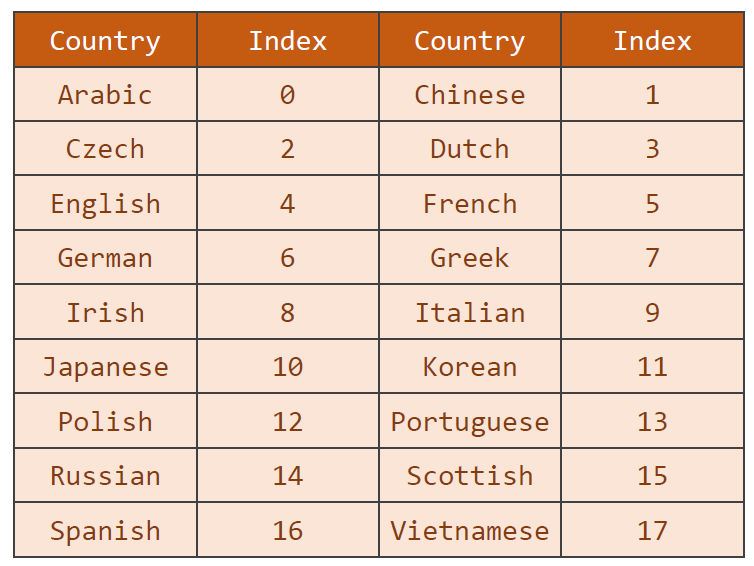
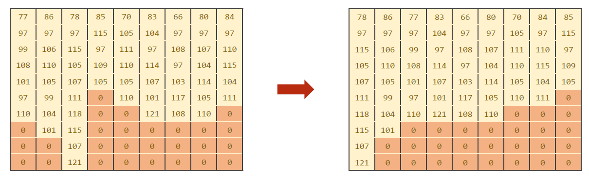
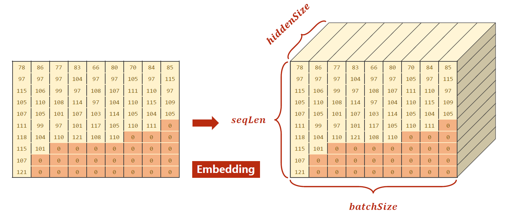
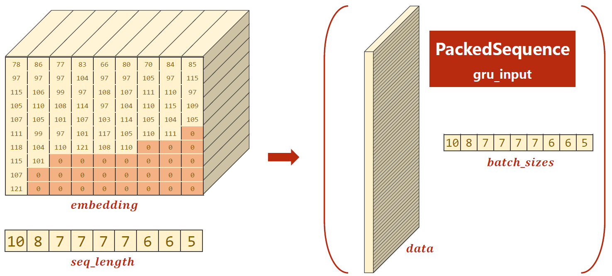
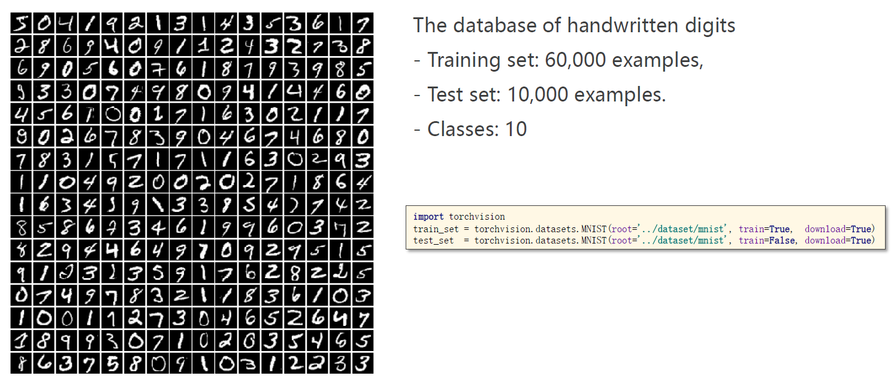
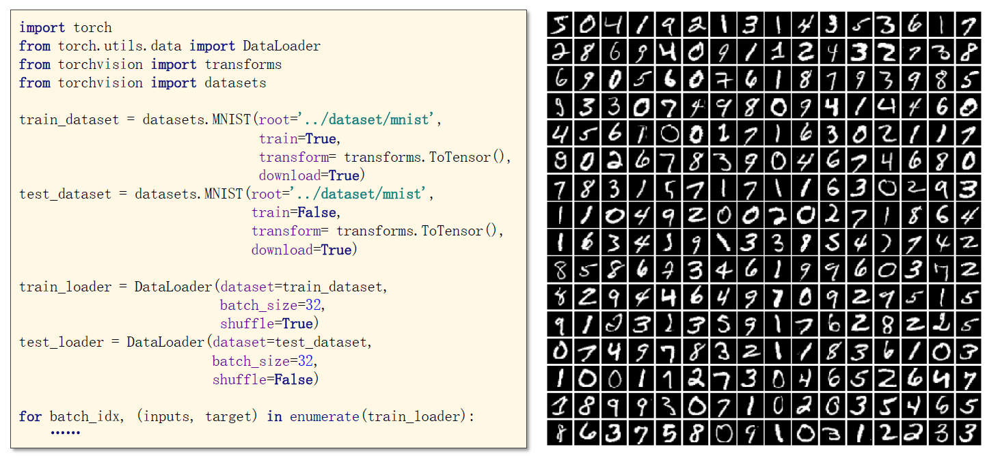

# 循环神经网络-高级

## 代码示例

代码功能：基于RNN的 names 数据集训练，即输入名字，输出这个名字所属的国家

* 神经网络结构，注意这里是用最终生成的隐藏节点去计算最终的输出值，而不是用每步的输出值来计算。

  

* 单词词典直接使用ASCII码即可，在将字符串转为向量时通过padding来统一长度。

  

  

* 国家词典

  

```python
import csv
import gzip
import torch
import torchvision
import numpy as np
import matplotlib.pyplot as plt
from torch.utils.data import Dataset
from torch.utils.data import DataLoader

####################### Part1. Prepare Dataset #######################

BEDDING_SIZE = 100
HIDDEN_SIZE = 100
BATCH_SIZE = 256
N_LAYER = 2  # 使用2层GRU
N_EPOCHS = 100  # 训练100轮
N_CHARS = 128  # ASCII码表中有128个字符


class NameDataset(Dataset):
    def __init__(self, is_train_set=True):
        # 通过csv和gzip包从.gz文件中读取.csv文件的数据
        fileName = "D:\\Dataset\\ForLearning\\names_train.csv.gz" if is_train_set else "D:\\Dataset\\ForLearning\\names_test.csv.gz"
        with gzip.open(fileName, 'rt') as f:
            reader = csv.reader(f)
            rows = list(reader)
        # 获取数据集，names即inputs，countries即labels
        self.names = [row[0] for row in rows]
        self.len = len(self.names)
        self.countries = [row[1] for row in rows]
        self.country_list = list(sorted(set(self.countries)))
        self.country_dict = self.getCountryDict()
        self.country_num = len(self.country_list)

    def __getitem__(self, item):
        return self.names[item], self.country_dict[self.countries[item]]

    def __len__(self):
        return self.len

    def getCountryDict(self):
        country_dict = dict()
        for index, country_name in enumerate(self.country_list, 0):
            country_dict[country_name] = index
        return country_dict

    def indexToCountry(self, index):
        return self.country_list[index]

    def getCountriesNum(self):
        return self.country_num


trainSet = NameDataset(is_train_set=True)
train_loader = DataLoader(trainSet, batch_size=BATCH_SIZE, shuffle=True)
testSet = NameDataset(is_train_set=False)
test_loader = DataLoader(testSet, batch_size=BATCH_SIZE, shuffle=False)

N_COUNTRY = trainSet.getCountriesNum()


####################### Part2. Design Model #######################

# 实现前向传播的过程中，如果对维数有疑问，可以查阅官方文档中对返回值shape的说明
class MyModule(torch.nn.Module):
    def __init__(self, input_size, embedding_size, hidden_size, num_layers, bidirectional, output_size):
        super(MyModule, self).__init__()
        self.num_directions = 2 if bidirectional else 1

        self.embedding = torch.nn.Embedding(input_size, embedding_size)
        self.gru = torch.nn.GRU(input_size=embedding_size,
                                hidden_size=hidden_size,
                                num_layers=num_layers,
                                bidirectional=bidirectional)
        self.fc = torch.nn.Linear(hidden_size * self.num_directions, output_size)

    def forward(self, x):
        # print("x =", x)
        # print("at first:", x.size())
        x = self.embedding(x)
        # print("after embedding:", x.size())
        _, x = self.gru(x)

        # RNN可能有好几层，当为单向RNN时，我们取最后一层的隐藏节点
        # 当为双向RNN时，我们取最后一层的两个方向隐藏节点，并按行方向（左右）拼接在一起
        if self.num_directions == 2:
            x = torch.cat([x[-1], x[-1]], dim=-1)
        else:
            x = x[-1]

        # print("after gru:", x.size())
        x = self.fc(x)
        # print("after fc:", x.size())
        return x.view(-1, N_COUNTRY)


# model = MyModule(N_CHARS, BEDDING_SIZE, HIDDEN_SIZE, N_LAYER, False, N_COUNTRY)
model = MyModule(N_CHARS, BEDDING_SIZE, HIDDEN_SIZE, N_LAYER, True, N_COUNTRY)

####################### Part3. Construct Loss and Optimizer #######################

criterion = torch.nn.CrossEntropyLoss()
optimizer = torch.optim.Adam(model.parameters(), lr=0.001)


####################### Part4. Train and Test #######################

# 为数据集做填充，使得每组数据的输入序列一样长
# 这里的maxLen是每个batch内的maxLen，不是整个数据集的maxLen
# 比如["ABCD","BCD"]转为[[65,66,67,68],[66,67,68,0]]
def fix(matrix, maxLen):
    for row in matrix:
        assert len(row) <= maxLen
        for i in range(len(row), maxLen):
            row.append(0)
    return matrix

# 将字符串转为ASCII编码，比如["ABCD","BCD"]转为[[65,66,67,68],[66,67,68]]
def names_to_matrix(names):
    matrix = []
    maxLen = -1
    for name in names:
        row = []
        maxLen = max(maxLen, len(name))
        for ch in name:
            row.append(ord(ch))
        matrix.append(row)

    # 填充使得全部输入的序列长度相同
    matrix = fix(matrix, maxLen)
    # 转置是为了将形状调整为(seqLen, batchSize)
    return np.transpose(matrix)


def train():
    for (names, countries) in train_loader:
        names = names_to_matrix(names)
        names = torch.LongTensor(names)
        countries = torch.LongTensor(countries)

        y_pred = model(names)
        # print(y_pred.size(), countries.size())
        loss = criterion(y_pred, countries)
        optimizer.zero_grad()
        loss.backward()
        optimizer.step()


def test(current_epoch):
    correct = 0
    total = 0
    with torch.no_grad():
        for (names, countries) in test_loader:
            names = names_to_matrix(names)
            names = torch.LongTensor(names)
            countries = torch.LongTensor(countries)

            y_pred = model(names)
            _, index = y_pred.max(dim=1)

            correct += (index == countries).sum().item()
            total += countries.size(0)
    accuracy = correct / total
    print(current_epoch, "test accuracy:", accuracy)
    return  accuracy


if __name__ == "__main__":
    accuracy_list = []
    for epoch in range(30):
        train()
        accuracy_list.append(test(epoch+1))

    plt.plot(accuracy_list)
    plt.xlabel("epoch")
    plt.ylabel("accuracy")
    plt.show()
```

* 为了加速GRU的计算，可以将输入按照实际长度降序排序，然后压缩

  * 第二张图的映射并不完全准确，只是示意图

  

  

* pack_padded_sequence 的功能大致就是如图所示，将各个列都叠在一起，且只保留非零部分。但是要求原向量各列的实际长度按照降序排列。详细内容可以参考[官方文档](https://pytorch-cn.readthedocs.io/zh/latest/package_references/torch-nn/#torchnnutilsrnnpack_padded_sequenceinput-lengths-batch_firstfalsesource)。

  

 # torchvision中的训练集

* 详细内容请参考[官方文档](https://pytorch-cn.readthedocs.io/zh/latest/torchvision/torchvision-datasets/)



 