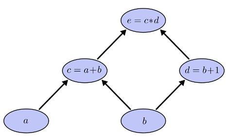
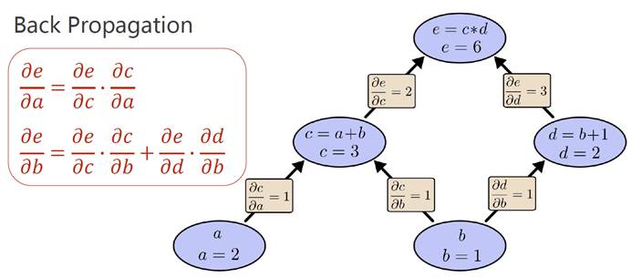

# 计算图

​		考虑如下的计算图，一般每个单元格中都是进行一些原子操作，然后通过计算图组合成复杂的运算：

​		计算图的好处是在进行反向传播时，只要计算每条边对应的偏导的值，作为这条边的权重，然后在求某一节点的反向传播值时，将从根节点（输出节点）到该节点的某一路径上的边的权重乘起来，然后求所有路径的和，即可得到最终的反向传播值。

​		底层的数学原理是微积分中的链式法则。

​		在下图中，b节点的反向传播值就是6.

​		在吴恩达的深度学习课程中，反向传播时我们是直接求出损失函数关于参数的偏导关系式，然后利用关系式求解。但是在神经网络的结构非常复杂时，这种做法显然是行不通的，此时就通过计算图来实现反向传播。