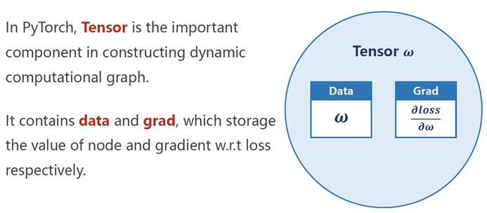
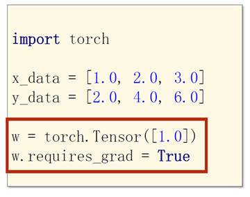

# 线性回归

​		在PyTorch中，Tensor（张量）>是基本单元，它包含参数和损失函数关于这个参数的导数。

​		下图的代码定义了一个，w 为 [1.0] 的Tensor，将requires_grad置为True表示这个参数需要计算梯度。默认为False。

​		如果w需要计算梯度，那么通过w计算得到的a也需要计算梯度，其中w和a都是Tensor。Tensor之间的乘法可以直接用*进行，已经被重载过了。

