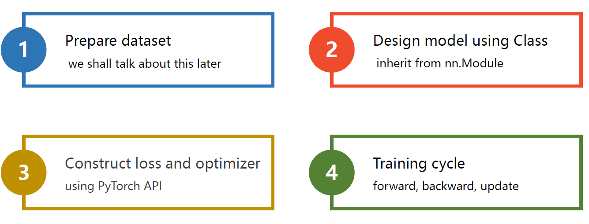
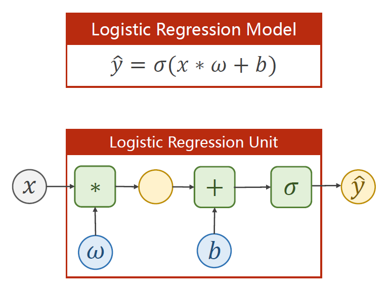

# Logistic回归

 在PyTorch中构建神经网络的步骤大致如下：



​		在构建神经网络时，我们通过实现一个继承自 torch.nn.Module 的类的方式，来实现我们自己的神经网络。我们只需要重写 init 和 forward 即可，PyTorch会通过计算图自动帮我们实现反向传播。注意 pytorch 中，数据集的数量所在的维数在第0维，所以线性单元中应该是 y = xw + b

​		init 方法的第一行代码是固定写法，调用父类构造器时，第一个参数写自己的类名，而第二行代码创建了一个 输入为1个, 输出也为1的[线性单元](https://pytorch-cn.readthedocs.io/zh/latest/package_references/torch-nn/#linear-layers)。这个单元同样继承自 torch.nn.Module，因此会自动进行反向传播。

​		图中的 LinearModel 其实就是 torch.nn.Linear ，只不过套了层壳，演示一下大致写法。注意，我们实现的这个类是callable的，即可以通过 **实例名(参数)** 的方式来调用这个类的\_\_call\_\_方法。


​		下图中的代码创建了代价函数以及优化器。更多的[代价函数](https://pytorch-cn.readthedocs.io/zh/latest/package_references/torch-nn/)与[优化器](https://pytorch-cn.readthedocs.io/zh/latest/package_references/torch-optim/)可以参考官方文档。注意到图中将size_average置为了False，理由是如果可以保证每个数据集的数据量都相同，那么这里除不除其实都一样。但是如果使用了mini-batch，此时最后一组batch和前面的batch的数据量不一定相同，此时就一定要置为True，其他时候任意。

​		事实上，在PyTorch中，可以为不同的参数指定不同的优化器。


​		一般而已，在回归问题中，我们使用MSE作为损失函数，因为我们输出的是一个数值，而在分类问题中，比如logistic回归和softmax回归中，我们使用交叉熵作为损失函数，因为我们输出的其实是一个概率，或者说一个分布。

## 代码示例1

 代码功能：演示python中通过 *args 和 **kwargs 来接受参数 以及 类的 \_\_call\_\_方法

```python
class Foobar:
    def __init__(self):
        pass

    def __call__(self, *args, **kwargs):
        print(args)   # (1, 2, 3)
        print(kwargs) # {'x': 4, 'y': 5}

foobar = Foobar()
foobar(1,2,3,x=4,y=5)
```

## 代码示例2

代码功能：使用pytorch.nn.Linear实现线性回归

```python
import torch

# 模拟训练集，这里 y = 2x
x_train = torch.Tensor([[1], [2], [3]]) # 这是一个 (m,1) 的矩阵，数据集数量在第0维
y_train = torch.Tensor([[2], [4], [6]])

model = torch.nn.Linear(1, 1)
criterion = torch.nn.MSELoss()
optimizer = torch.optim.SGD(model.parameters(), lr=0.01)

for epoch in range(10000):
    y_pred = model(x_train) # 注意这里不是调用model.forward(x_train)
    loss = criterion(y_pred,y_train)
    print(epoch,loss)

    optimizer.zero_grad() # 清空之前的动量
    loss.backward()  # 反向传播计算梯度
    optimizer.step() # 利用计算好的梯度更新参数

print("w =",model.weight.item()) # w = 1.9999957084655762
print("b =",model.bias.item())   # b = 8.701974365976639e-06

# 测试集
x_test = torch.Tensor([4])
y_test = model(x_test)
print("y_pred =",y_test) # y_pred = tensor([8.0000], grad_fn=<AddBackward0>)
```

## 代码示例3

代码功能：使用pytorch实现 logistic 回归

* import torch.nn.functional as F
* 也可以通过 torch.sigmoid(z) 进行调用
* 但是更好的做法是 self.activate = torch.nn.Sigmoid()，之后通过 self.activate(x) 的方式来激活
  * 这样做的好处是以后如果要更换激活函数，就只要改一行代码就够了



