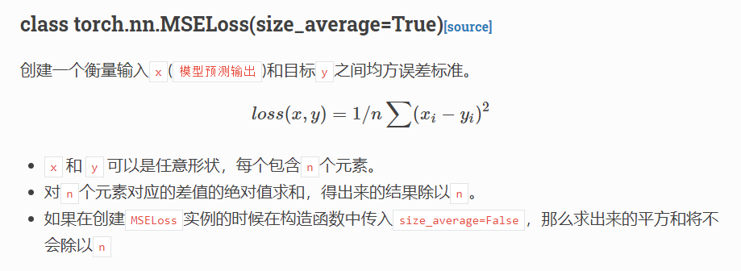

# Logistic回归

 在PyTorch中构建神经网络的步骤大致如下：

​		在构建神经网络时，我们通过实现一个继承自 torch.nn.Module 的类的方式，来实现我们自己的神经网络。我们只需要重写 init 和 forward 即可，PyTorch会通过计算图自动帮我们实现反向传播。注意 pytorch 中，数据集的数量所在的维数在第0维，所以线性单元中应该是 y = xw + b

​		init 方法的第一行代码是固定写法，调用父类构造器时，第一个参数写自己的类名，而第二行代码创建了一个 输入为1个, 输出也为1的[线性单元](https://pytorch-cn.readthedocs.io/zh/latest/package_references/torch-nn/#linear-layers)。这个单元同样继承自 torch.nn.Module，因此会自动进行反向传播。

​		图中的 LinearModel 其实就是 torch.nn.Linear ，只不过套了层壳，演示一下大致写法。注意，我们实现的这个类是callable的，即可以通过 **实例名(参数)** 的方式来调用这个类的\_\_call\_\_方法。

​		下图中的代码创建了代价函数以及优化器。更多的[代价函数](https://pytorch-cn.readthedocs.io/zh/latest/package_references/torch-nn/)与[优化器](https://pytorch-cn.readthedocs.io/zh/latest/package_references/torch-optim/)可以参考官方文档。注意到图中将size_average置为了False，理由是如果可以保证每个数据集的数据量都相同，那么这里除不除其实都一样。但是如果使用了mini-batch，此时最后一组batch和前面的batch的数据量不一定相同，此时就一定要置为True，其他时候任意。

​		事实上，在PyTorch中，可以为不同的参数指定不同的优化器。

​		一般而已，在回归问题中，我们使用MSE作为损失函数，因为我们输出的是一个数值，而在分类问题中，比如logistic回归和softmax回归中，我们使用交叉熵作为损失函数，因为我们输出的其实是一个概率，或者说一个分布。

