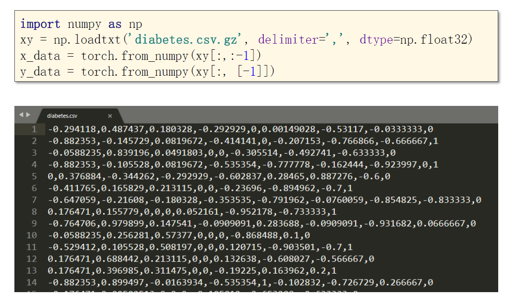
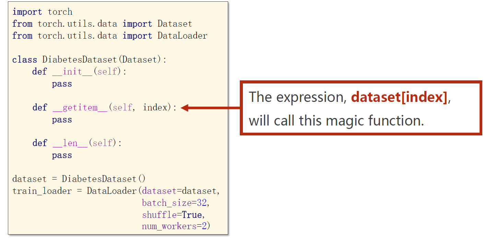
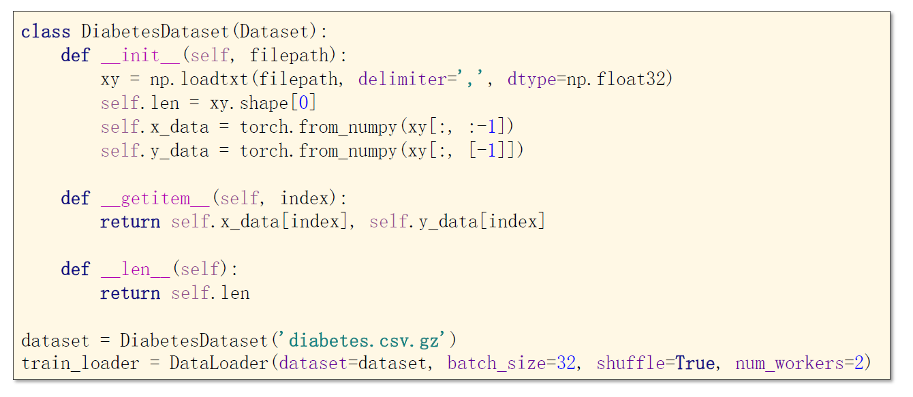
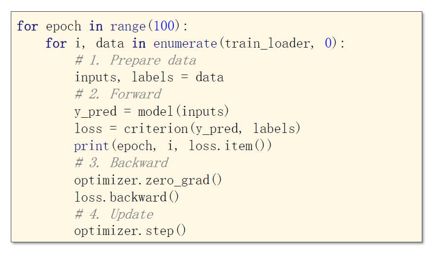
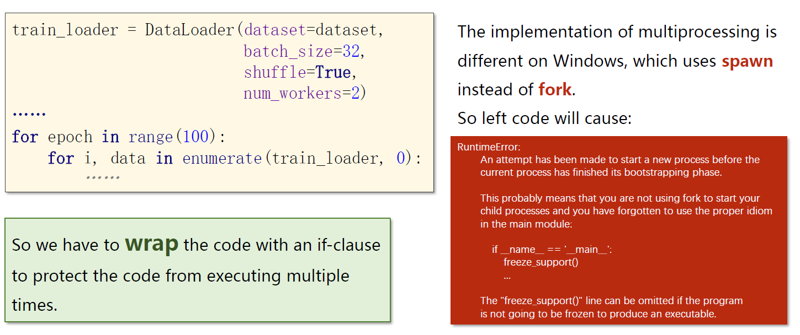
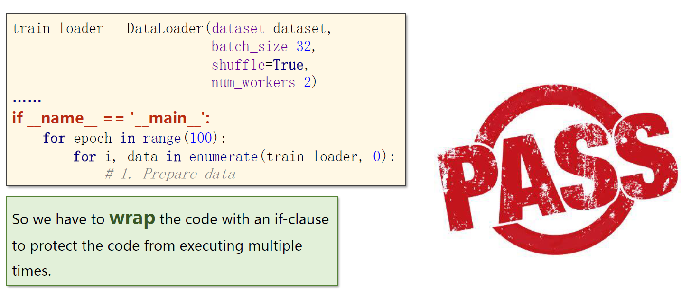

# 加载数据集

​		下图演示了一种从文件中取出数据的方式，其中 gz 是一种压缩包，这里也可以选择解压后读取 diabetes.csv文件。这种读取数据的方式有一个缺点，即在使用 mini-batch 时，需要自己手动切割。事实上，我们可以通过 DataLoader 来更方便地实现 mini-batch。

​		注意，在神经网络中一般不用double，常用的是32位的float，因为多数GPU只支持32位浮点数。

 

​		Dataset是一个抽象类，我们需要继承并实现它。并且我们需要重写 \_\_getitem\_\_ 和 \_\_len\_\_方法，len方法用于在调用len(...)时，返回这个数据集的数据量。

​		对于 init 方法，有两种实现思路，一种是一口气把全部数据读进来，另一种是只进行初始化，数据在之后要用的时候再读入（用多少读多少）。后者的应用场景是数据量很大，内存可能存不下的情况。

​		DataLoader构造方法中的 num_workers 表示读取数据时使用的线程数。

 ## 代码示例

代码功能：Dataset的一个具体实现，以及如果遍历DataLoader

## 一个注意事项

​		在Windows下启用多线程需要用检查一下当前线程是否为主线程。

