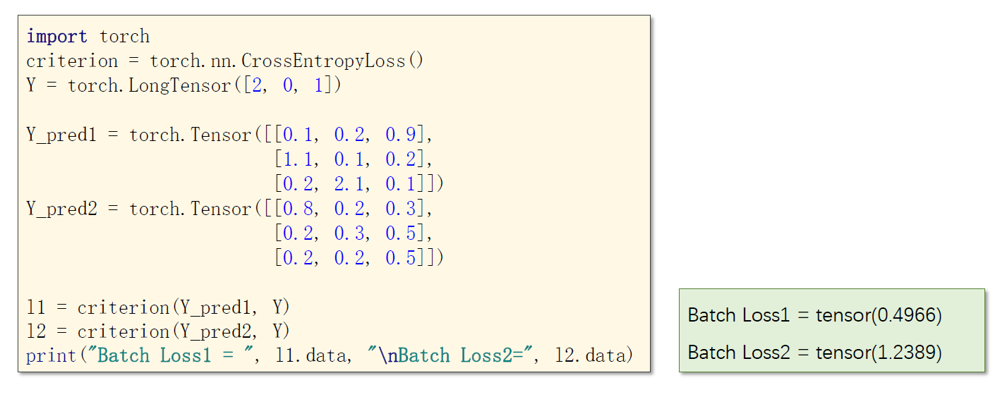

# 多分类问题


 		在pytorch中实现softmax模块时需要注意，CrossEntropyLoss直接把后面一整块都给封装了，因此传给这个模块的值是不需要激活的，直接传线性值即可！同时要注意 y 应该为 LongTensor。

 

 ## 代码示例

代码功能：通过一个5层全连接神经网络，演示 Torch.nn.CrossEntropyLoss 的用法。

* 这里的 Y_pred 都是没有激活过的
* 关于 Tensor 的 view 方法的使用请参考[官方文档](https://pytorch-cn.readthedocs.io/zh/latest/package_references/Tensor/#viewargs-tensor)



```python
import torch
import torchvision
import numpy as np
import matplotlib.pyplot as plt
from torch.utils.data import Dataset
from torch.utils.data import DataLoader

####################### Part1. Prepare Dataset #######################

batch_size = 64

# 依次执行其中的transform
# 1. 将PIL图像转为Pytorch的Tensor，图像张量的形状一般为(m,W*H*C)，但在pytorch中是(m,C*W*H)
# 2. 将输入参数归一化，使其均值为0，标准差为1
# 其中，0.1307是整个mnist数据集的均值，0.3081是整个mnist数据集的标准差
transform = torchvision.transforms.Compose([
    torchvision.transforms.ToTensor(),
    torchvision.transforms.Normalize(0.1307, 0.3081)
])

x_train = torchvision.datasets.MNIST(root="D:/Drafts/mnist", train=True, download=True, transform=transform)
train_loader = DataLoader(x_train, shuffle=True, batch_size=batch_size)

x_test = torchvision.datasets.MNIST(root="D:/Drafts/mnist", train=False, download=True, transform=transform)
test_loader = DataLoader(x_test, shuffle=False, batch_size=batch_size)


####################### Part2. Design Model #######################

class MyModule(torch.nn.Module):
    def __init__(self):
        super(MyModule, self).__init__()
        self.l1 = torch.nn.Linear(784, 512)
        self.l2 = torch.nn.Linear(512, 256)
        self.l3 = torch.nn.Linear(256, 128)
        self.l4 = torch.nn.Linear(128, 64)
        self.l5 = torch.nn.Linear(64, 10)
        self.activate = torch.nn.ReLU()

    def forward(self, x):
        # 类似于np.array的reshape，-1表示根据其他维数来推算这一维
        x = x.view(-1, 784)
        x = self.activate(self.l1(x))
        x = self.activate(self.l2(x))
        x = self.activate(self.l3(x))
        x = self.activate(self.l4(x))
        # 使用的损失函数是CrossEntropyLoss，因此最后一步不要激活
        x = self.l5(x)
        return x


model = MyModule()

####################### Part3. Construct Loss and Optimizer #######################

criterion = torch.nn.CrossEntropyLoss()
optimizer = torch.optim.Adam(model.parameters(), lr=0.01)


def train():
    cost_total = 0
    for i, data in enumerate(train_loader):
        inputs, labels = data

        y_pred = model(inputs)

        cost = criterion(y_pred, labels)
        cost_total += cost.item()

        optimizer.zero_grad()
        cost.backward()
        optimizer.step()

    return cost_total


####################### Part4. Train and Test #######################

def test():
    correct = 0
    total = 0

    with torch.no_grad():
        for i, data in enumerate(test_loader):
            inputs, labels = data

            y_pred = model(inputs)
            _, outputs = torch.max(y_pred.data, dim=1)

            # np.array用shape看各维度的维数，torch.Tensor用size看各维度的维数
            total += labels.size(0)
            correct += (outputs == labels).sum().item()

    print("test accuracy:", correct / total)


if __name__ == "__main__":
    for epoch in range(10):
        train()
        test() # 最终的准确率大致是96%
```