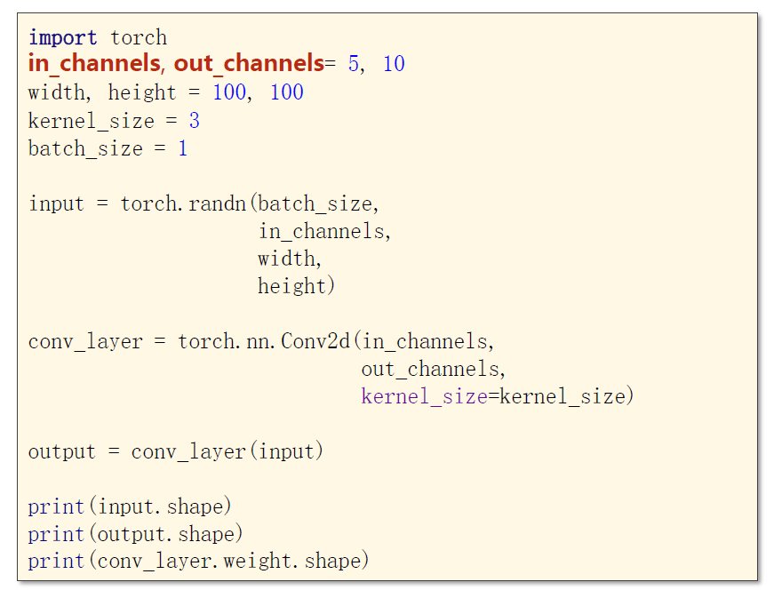
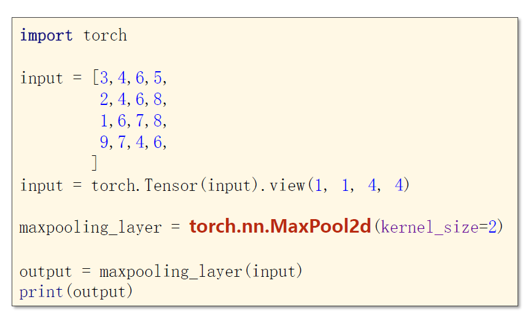

# 卷积神经网络

* 图中的 Subsampling（下采样）其实就是池化层。注意池化层的 stride 一般和 size 一样大。


​		在吴恩达的深度学习课程中，提到过过滤器的通道数必须和输入的通道数一致。这里补充一点，过滤器的各个通道中的参数是可以不一样的。具体参考下图：


## 代码示例1

代码功能：演示 pytorch 中的卷积层和池化层

* 这里的 kernel_size 也可以是一个元组，比如 (5,3) ，但是一般而言都是用正方形的过滤器的。
* Conv2d 构造器的更多参数可以参考[官方文档](https://pytorch-cn.readthedocs.io/zh/latest/package_references/torch-nn/) 
  * 常见的参数主要有：padding、bias、stride等





## 代码示例2

代码功能：基于CNN的 mnist 数据集训练

```python
import torch
import torchvision
from torch.utils.data import DataLoader

####################### Part1. Prepare Dataset #######################

batch_size = 128

transform = torchvision.transforms.Compose([
    torchvision.transforms.ToTensor(),
    torchvision.transforms.Normalize(0.1307, 0.3081)
])

x_train = torchvision.datasets.MNIST(root="D:/Drafts/mnist", train=True, transform=transform, download=False)
train_loader = DataLoader(x_train, batch_size=batch_size, shuffle=True, num_workers=2)

x_test = torchvision.datasets.MNIST(root="D:/Drafts/mnist", train=False, transform=transform, download=False)
test_loader = DataLoader(x_test, batch_size=batch_size, shuffle=False, num_workers=2)


####################### Part2. Design Model #######################

class MyModule(torch.nn.Module):
    def __init__(self):
        super(MyModule, self).__init__()
        self.conv1 = torch.nn.Conv2d(1, 10, 5)
        self.pool1 = torch.nn.MaxPool2d(2)
        self.conv2 = torch.nn.Conv2d(10, 20, 5)
        self.pool2 = torch.nn.MaxPool2d(2)
        self.fc1 = torch.nn.Linear(320, 10)
        self.activate = torch.nn.ReLU()

    def forward(self, x):
        # x的初始形状为 (batch,1,28,28)
        x = self.activate(self.conv1(x))
        x = self.activate(self.pool1(x))
        x = self.activate(self.conv2(x))
        x = self.activate(self.pool2(x))
        # x的当前形状为 (batch,20,4,4)
        x = x.view(-1, 20 * 4 * 4)
        x = self.fc1(x)
        return x


model = MyModule()

# 启用GPU进行模型训练，cude:0 表示使用本机的第0块显卡
# 注：一台电脑可以配备多块显卡
device = torch.device("cude:0" if torch.cuda.is_available() else "cpu")
model.to(device)

####################### Part3. Construct Loss and Optimizer #######################

criterion = torch.nn.CrossEntropyLoss()
optimizer = torch.optim.Adam(model.parameters(), lr=0.01)


####################### Part4. Train and Test #######################

def train():
    loss_total = 0

    for batch_index, data in enumerate(train_loader):
        inputs, labels = data
        # 启用GPU进行模型训练，须使用和前一步一样的显卡
        inputs, labels = inputs.to(device), labels.to(device)

        y_pred = model(inputs)
        loss = criterion(y_pred, labels)
        optimizer.zero_grad()
        loss.backward()
        optimizer.step()

        loss_total += loss.item()

    return loss_total


def test():
    correct = 0
    total = 0

    with torch.no_grad():
        for data in test_loader:
            inputs, labels = data
            # 启用GPU进行模型训练，须使用和前几步一样的显卡
            inputs, labels = inputs.to(device), labels.to(device)

            y_pred = model(inputs)
            _, outputs = torch.max(y_pred, dim=1)

            total += outputs.size(0)
            correct += (outputs == labels).sum().item()

    print("test accuracy:", 100 * correct / total)


if __name__ == "__main__":
    for epoch in range(5):
        print("<----- %d ----->" % epoch)
        train()
        test() # 最终的准确率大致是98%
```