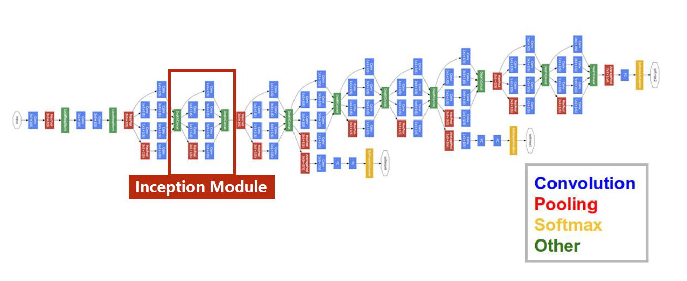
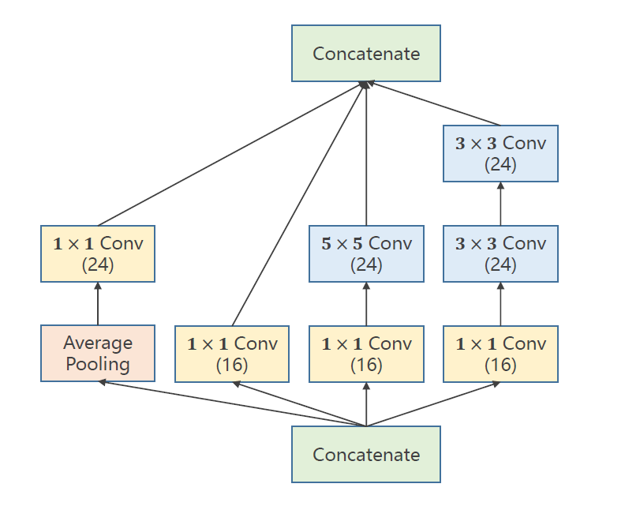
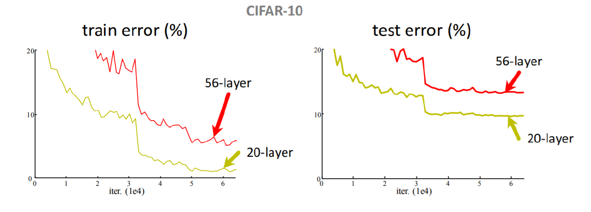

# 卷积神经网络-高级

​		下图所示的是GoogleNet，这是一个很常用的神经网络基础架构。在实现这一基础架构时，可以先实现 Inception Module 等模块，然后再拼接这个大模块。

​		这里的 Inception Module是这门课程给出的，和吴恩达深度学习课程中给出的不太一样。但都需要注意的一点是，各个分支最后得到的输出，他们的宽高必须能匹配上。至于各自的通道数是多少，这个没有规定，反正都能拼接上。

​		在实现神经网络时需要注意，并不是越层数越多越好，下图的数据就证明了这一点。造成这一现象的原因有：过拟合、梯度消失等诸多原因。当然，这只是对于 PlainNet 而言的，对于 ResNet，那就是多多益善了。

​		在 pytorch 中实现 ResNet 时，其实就是在 identity block 或 convolutional block中把返回值改成 x + x_0 即可。

