# 循环神经网络

​		下图是RNN基本单元的一个结构图，这个图和吴恩达深度学习中介绍的是一样的，只不过在深度学习课程中，我们假设输出的是一个多分类（one-hot向量），因此输出直接走softmax了，而这里而没有对输出进行明确假设。

​		<font style="color:red">input_size</font> 和 <font style="color:red">hidden_size</font> 分别表示<font style="color:red">输入参数</font>和<font style="color:red">隐藏参数</font>的维度。使用时直接 hidden = cell( input, hidden ) 即可。


​		具体的使用方式如下：

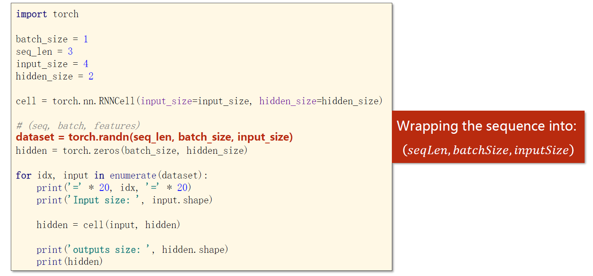

​		在使用 PyTorch 实现具有多层结构的 RNN 时，我们可以直接指定层数 num_layers，inputs就是下面整个的 x 序列，而 hidden 就是左边的h0，注意这里左侧和右侧的h其实都是 (num_layers, hidden_size) 的向量。

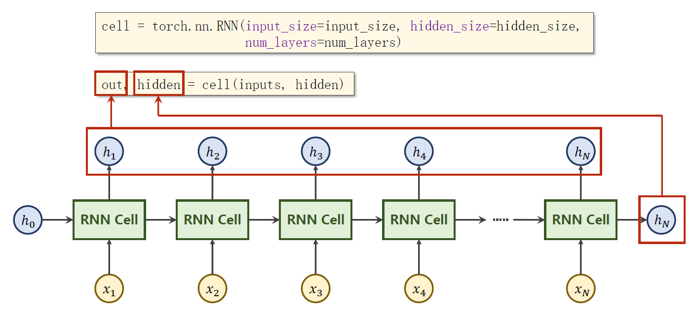

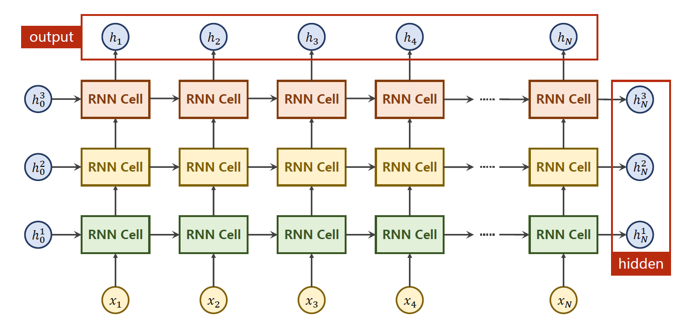

​		具体使用方式如下，注意这里对 inputs 的维度要求是第一维是序列长度。

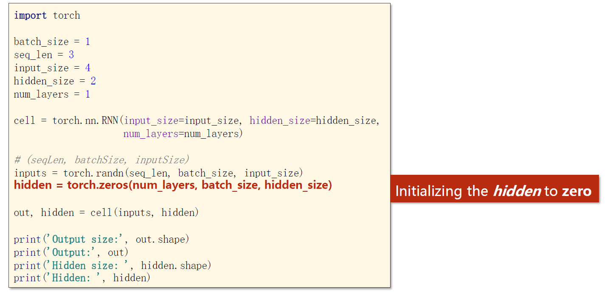

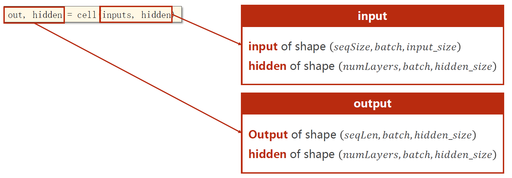

​		有时为了方便构造数据集，也会把 batch_size 放在第一个，序列长度放在第二个。

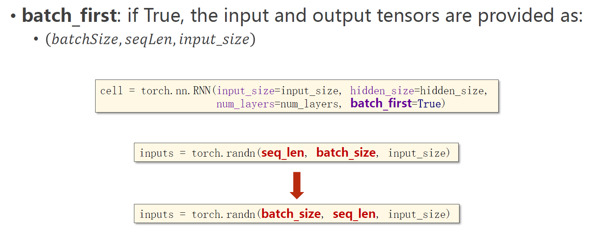

​		LSTM模块和GRU模块的用法也差不多，详情参考[LSTM](https://pytorch-cn.readthedocs.io/zh/latest/package_references/torch-nn/#class-torchnnlstm-args-kwargssource)和[GRU](https://pytorch-cn.readthedocs.io/zh/latest/package_references/torch-nn/#class-torchnngru-args-kwargssource)的官方文档。

## 其他内容

​		假设现在希望训练一个RNN模型，学习 hello ==> ohlol 的变化规律。首先就得考虑数据要怎么存储才能输入给这个神经网络。其中一种方式就是建立字典，然后将单词存储在 one-hot 向量中。

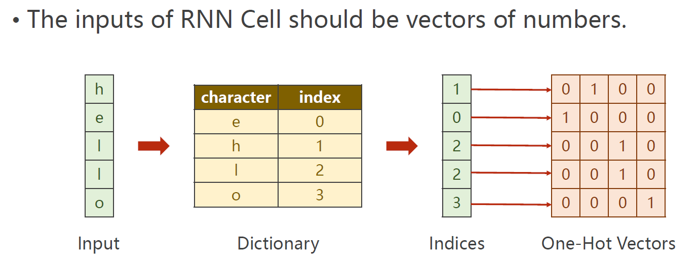

​		将单词转化为 one-hot 向量的代码示例，同时需要注意调整 Tensor 的维度。

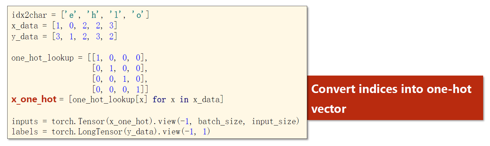

## Embedding层

​		one-hot 方式具有维度高、稀疏、硬编码的缺点，为此引入 embedding 层来表示字符串。embedding 具有维度低，稠密，可学习等优点。其基本思想是将高维稀疏的 one-hot 映射至一个稠密的低纬的空间中，其实就是常说的数据降维。

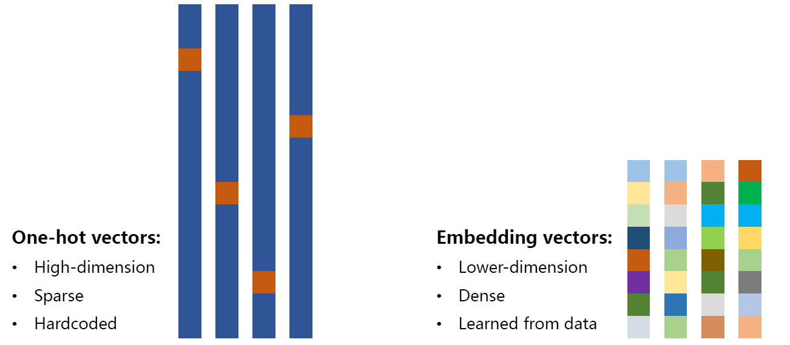

​		以后在我们的神经网络中，就引入一层 Embedding 层，将 one-hot 向量转为稠密表示。

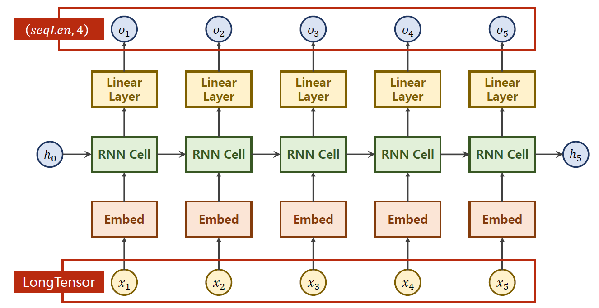

​		关于 Embedding 层的详细用法请参考[官方文档](https://pytorch-cn.readthedocs.io/zh/latest/package_references/torch-nn/#sparse-layers)。

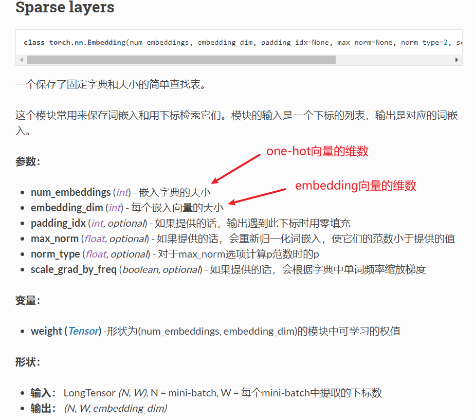

## 代码示例1

代码功能：使用RNNCell和RNN学习 hello ==> ohlol

* 使用RNNCell
  * 注意RNNCell一次只能处理一个序列中的一个字符。
  * labels 的 shape 是 (seqLen, 1)
  * 注意在一个数据集中，各个数据的输入序列长度可能是不一样的。此时需要做填充。

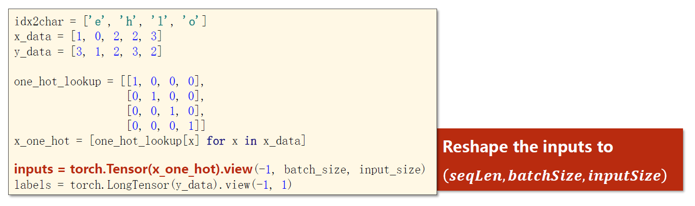

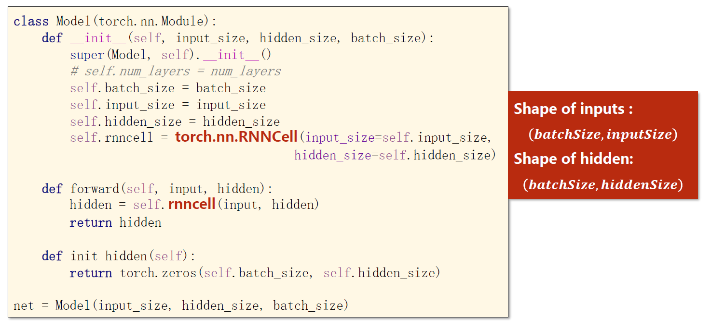

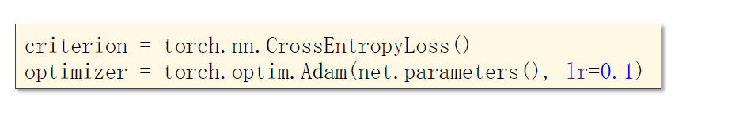

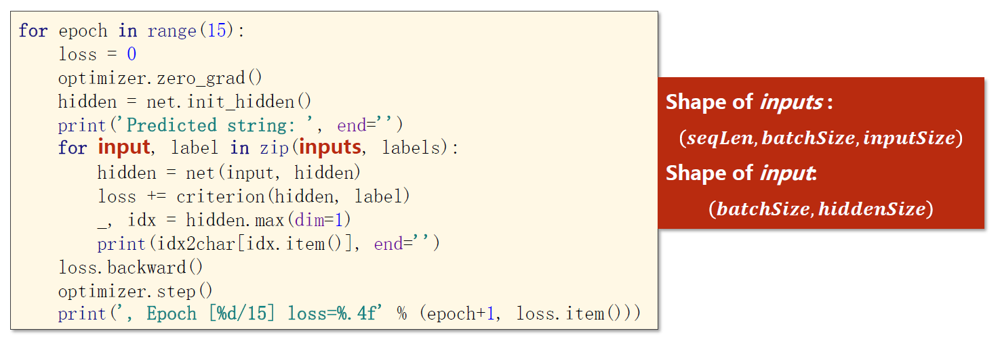

* 使用RNN
  * labels 的 shape 是 (seqLen*batchSize, 1)，这里最好也 view 成 (-1, 1)


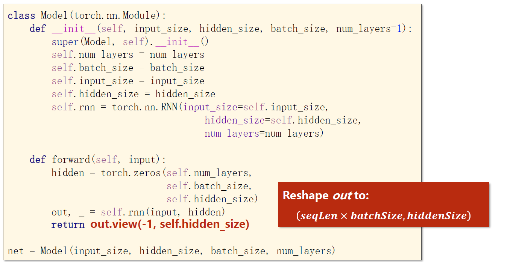

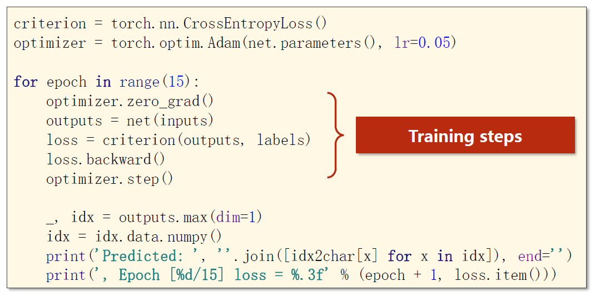

## 代码示例2

代码功能：实现一个增加了 embedding 层的RNN

* 这里一定要注意 x_data 和 y_data 的维数！

```python
import torch

####################### Part1. Prepare Dataset #######################

dictionary = ['e', 'h', 'l', 'o']
# 注意这里并没有真的用one-hot向量来表示
x_data = [[1, 0, 2, 2, 3]]  # hello
y_data = [3, 1, 2, 3, 2]  # ohlol

inputs = torch.LongTensor(x_data)
labels = torch.LongTensor(y_data)

num_class = len(dictionary)  # 字典的长度
inputs_size = num_class  # 输入的维数，不是batch_size
hidden_size = 8  # 隐藏层的维数
embedding_size = 10  # embedding向量的维数，即将one-hot压缩（扩大）至几维
num_layers = 2  # RNN的层数
batch_size = 1  # batch_size，这里只有1组数据，所以取1
seq_len = len(x_data)  # 输入序列的长度，如果各数据输入序列长度不同，则取最大值

print(inputs.size()) # torch.Size([1, 5])，即[batchSize, seqLen]
print(labels.size()) # torch.Size([5])，即[batchSize * seqLen]


####################### Part2. Design Model #######################

class MyModule(torch.nn.Module):
    def __init__(self):
        super(MyModule, self).__init__()
        self.emb = torch.nn.Embedding(inputs_size, embedding_size)
        self.rnn = torch.nn.RNN(input_size=embedding_size,
                                hidden_size=hidden_size,
                                num_layers=num_layers,
                                batch_first=True)
        self.fc = torch.nn.Linear(hidden_size, num_class)

    def forward(self, x):
        # hidden的形状为(num_layers * num_directions, batchSize, hidden_size)
        # hidden其实就是每个元素对应的记忆细胞，所以是每组数据都要有自己的，不能共用别人的
        hidden = torch.zeros(num_layers, x.size(0), hidden_size)
        x = self.emb(x)  # 输入值形状为(batchSize, seqLen), 输出值形状为(batchSize, seqLen, embeddingSize)
        x, _ = self.rnn(x, hidden)  # 输出值形状为(batchSize, seqLen, hiddenSize)
        							# 注意这里的返回值是(output, h_n)，详情参考官方文档
        x = self.fc(x)  # 输出值形状为(batchSize, seqLen, numClass)
        return x.view(-1, num_class)  # reshape是为了维度和labels匹配，然后使用CrossEntropy损失函数


model = MyModule()

####################### Part3. Construct Loss and Optimizer #######################

criterion = torch.nn.CrossEntropyLoss()
optimizer = torch.optim.Adam(model.parameters(), lr=0.01)

####################### Part4. Train and Test #######################

for epoch in range(15):
    y_pred = model(inputs)
    loss = criterion(y_pred, labels)
    optimizer.zero_grad()
    loss.backward()
    optimizer.step()

    # 返回输入张量给定维度上每行的最大值，并同时返回每个最大值的位置索引
    _, index = y_pred.max(dim=1)
    index = index.data.numpy()
    print("Predicted:", "".join([dictionary[x] for x in index]), end="")
    print(", Epoch [%d/15] loss = %.3f" % (epoch + 1, loss.item()))
```