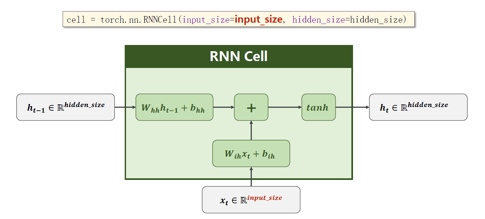

# 循环神经网络

​		下图是RNN基本单元的一个结构图，这个图和吴恩达深度学习中介绍的是一样的，只不过在深度学习课程中，我们假设输出的是一个多分类（one-hot向量），因此输出直接走softmax了，而这里而没有对输出进行明确假设。

​		input_size 和 hidden_size 分别表示输入参数和隐藏参数的维度。使用时直接 hidden = cell( input, hidden ) 即可。

​		具体的使用方式如下：

​		在使用 PyTorch 实现具有多层结构的 RNN 时，我们可以直接指定层数 num_layers，inputs就是下面整个的 x 序列，而 hidden 就是左边的h0，注意这里左侧和右侧的h其实都是 (num_layers, hidden_size) 的向量。

​		具体使用方式如下，注意这里对 inputs 的维度要求是第一维是序列长度。

​		有时为了方便构造数据集，也会把 batch_size 放在第一个，序列长度放在第二个。

​		LSTM模块和GRU模块的用法也差不多，详情参考[LSTM](https://pytorch-cn.readthedocs.io/zh/latest/package_references/torch-nn/#class-torchnnlstm-args-kwargssource)和[GRU](https://pytorch-cn.readthedocs.io/zh/latest/package_references/torch-nn/#class-torchnngru-args-kwargssource)的官方文档。

## 其他内容

​		假设现在希望训练一个RNN模型，学习 hello ==> ohlol 的变化规律。首先就得考虑数据要怎么存储才能输入给这个神经网络。其中一种方式就是建立字典，然后将单词存储在 one-hot 向量中。

​		将单词转化为 one-hot 向量的代码示例，同时需要注意调整 Tensor 的维度。

## Embedding层

​		one-hot 方式具有维度高、稀疏、硬编码的缺点，为此引入 embedding 层来表示字符串。embedding 具有维度低，稠密，可学习等优点。其基本思想是将高维稀疏的 one-hot 映射至一个稠密的低纬的空间中，其实就是常说的数据降维。

​		以后在我们的神经网络中，就引入一层 Embedding 层，将 one-hot 向量转为稠密表示。

​		关于 Embedding 层的详细用法请参考[官方文档](https://pytorch-cn.readthedocs.io/zh/latest/package_references/torch-nn/#sparse-layers)。

