# 计算图

​		考虑如下的计算图，一般每个单元格中都是进行一些原子操作，然后通过计算图组合成复杂的运算：


​		计算图的好处是在进行反向传播时，只要计算每条边对应的偏导的值，作为这条边的权重，然后在求某一节点的反向传播值时，将从根节点（输出节点）到该节点的某一路径上的边的权重乘起来，然后求所有路径的和，即可得到最终的反向传播值。

​		底层的数学原理是微积分中的链式法则。

​		在下图中，b节点的反向传播值就是6.

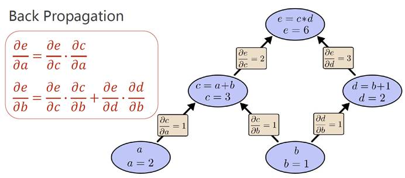

​		在吴恩达的深度学习课程中，反向传播时我们是直接求出损失函数关于参数的偏导关系式，然后利用关系式求解。但是在神经网络的结构非常复杂时，这种做法显然是行不通的，此时就通过计算图来实现反向传播。

# 梯度下降算法

​		通过计算图的方式描述神经网络的结构：


​		在上面的例子中，没有使用激活函数，所以这2层神经网络其实就等于1个1层神经网络。为此，我们需要使用非线性激活函数。

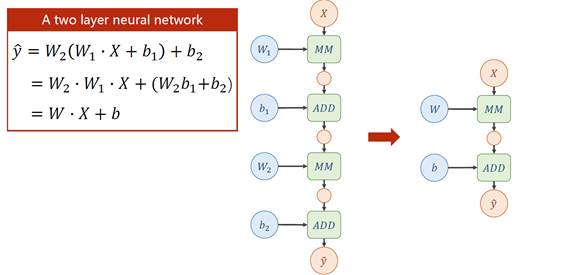

​		下图演示了在计算图中进行反向传播的过程，其中 r = y_pred - y

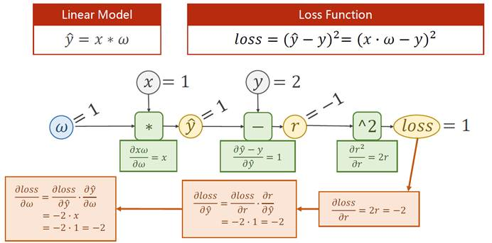

# 线性回归

​		在PyTorch中，<font color=red>Tensor（张量）</font>>是基本单元，它包含<font color=red>参数</font>和<font color=red>损失函数关于这个参数的导数</font>。

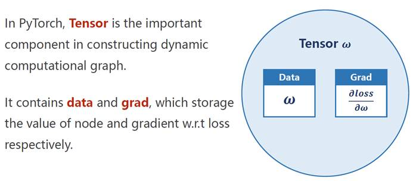

​		下图的代码定义了一个，w 为 [1.0] 的Tensor，将requires_grad置为True表示这个参数需要计算梯度。默认为False。

​		如果w需要计算梯度，那么通过w计算得到的a也需要计算梯度，其中w和a都是Tensor。Tensor之间的乘法可以直接用*进行，已经被重载过了。

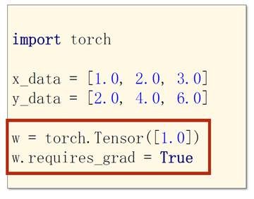

## 代码示例

代码功能：使用pytorch实现线性回归

* 需要注意的是，一旦执行过一次backward，就会释放原有的计算图，下次计算时需要创建一个新的计算图。这样设定的目的是因为每次迭代都可能使用不同的计算图。
* 更新参数时一定记得要转换成标量后再去计算，否则会导致计算图的膨胀。

```python
import torch

# 模拟训练集，这里 y = 2x
x_train = [1, 2, 3]
y_train = [2, 4, 6]

# 创建一个data为1.0的Tensor（张量）
w = torch.Tensor([1.0])
w.requires_grad = True


def forward(x, w):
    # 这里的w和x都是Tensor
    return w * x


def loss(x, y, w):
    y_pred = forward(x, w)
    return (y_pred - y) ** 2


# 训练100次
for epoch in range(100):
    # 这里为了方便理解，不使用向量化
    for x, y in zip(x_train, y_train):
        cost = loss(x, y, w)
        cost.backward()

        # 这里假设学习率为0.01
        # 须注意w.grad其实也是一个张量，更新参数时应该转换成标量来计算
        # 否则张量间的计算会构建计算图，循环多次后，可能会因为计算图过于庞大导致程序崩溃
        w.data = w.data - 0.01 * w.grad.data

        # 手动将原来的导数清零，如果不清零，就会保留原有的值，下次使用时会是 旧值+新值
        # 显然这样的设定是为了方便应用以后的各种优化方法
        w.grad.data.zero_()

    # cost.item()的返回值是一个int或float类型的数据
    # 这里输出的是上个训练集中最后一组数据的cost，并非总的cost
    # 如果要计算cost_total，应在上一个循环中使用sum += cost.item()
    # 如果使用sum_tensor += cost，那么会构建计算图来计算，性能不如直接进行标量运算
    # 但是sum == sum_tensor.item()为True
    print("epoch: ", epoch, ",\tcost: ", cost.item())

print(type(w.item()),w.item()) 	# <class 'float'> 1.9999996423721313
print(type(w.data),w.data) 		# <class 'torch.Tensor'> tensor([2.0000])
print(type(w),w) 				# <class 'torch.Tensor'> tensor([2.0000], requires_grad=True)
```

# Logistic回归

 在PyTorch中构建神经网络的步骤大致如下：


​		在构建神经网络时，我们通过实现一个继承自 torch.nn.Module 的类的方式，来实现我们自己的神经网络。我们只需要重写 init 和 forward 即可，PyTorch会通过计算图自动帮我们实现反向传播。注意 pytorch 中，数据集的数量所在的维数在第0维，所以线性单元中应该是 y = xw + b

​		init 方法的第一行代码是固定写法，调用父类构造器时，第一个参数写自己的类名，而第二行代码创建了一个 输入为1个, 输出也为1的[线性单元](https://pytorch-cn.readthedocs.io/zh/latest/package_references/torch-nn/#linear-layers)。这个单元同样继承自 torch.nn.Module，因此会自动进行反向传播。

​		图中的 LinearModel 其实就是 torch.nn.Linear ，只不过套了层壳，演示一下大致写法。注意，我们实现的这个类是callable的，即可以通过 **实例名(参数)** 的方式来调用这个类的\_\_call\_\_方法。

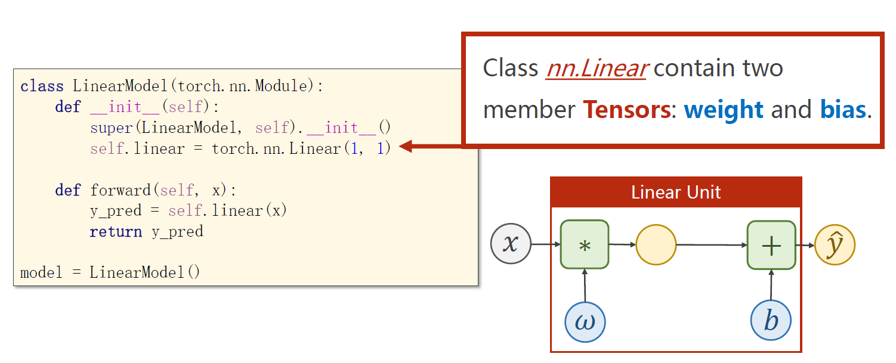


​		下图中的代码创建了代价函数以及优化器。更多的[代价函数](https://pytorch-cn.readthedocs.io/zh/latest/package_references/torch-nn/)与[优化器](https://pytorch-cn.readthedocs.io/zh/latest/package_references/torch-optim/)可以参考官方文档。注意到图中将size_average置为了False，理由是如果可以保证每个数据集的数据量都相同，那么这里除不除其实都一样。但是如果使用了mini-batch，此时最后一组batch和前面的batch的数据量不一定相同，此时就一定要置为True，其他时候任意。

​		事实上，在PyTorch中，可以为不同的参数指定不同的优化器。


​		一般而已，在回归问题中，我们使用MSE作为损失函数，因为我们输出的是一个数值，而在分类问题中，比如logistic回归和softmax回归中，我们使用交叉熵作为损失函数，因为我们输出的其实是一个概率，或者说一个分布。

## 代码示例1

 代码功能：演示python中通过 *args 和 **kwargs 来接受参数 以及 类的 \_\_call\_\_方法

```python
class Foobar:
    def __init__(self):
        pass

    def __call__(self, *args, **kwargs):
        print(args)   # (1, 2, 3)
        print(kwargs) # {'x': 4, 'y': 5}

foobar = Foobar()
foobar(1,2,3,x=4,y=5)
```

## 代码示例2

代码功能：使用pytorch.nn.Linear实现线性回归

```python
import torch

# 模拟训练集，这里 y = 2x
x_train = torch.Tensor([[1], [2], [3]]) # 这是一个 (m,1) 的矩阵，数据集数量在第0维
y_train = torch.Tensor([[2], [4], [6]])

model = torch.nn.Linear(1, 1)
criterion = torch.nn.MSELoss()
optimizer = torch.optim.SGD(model.parameters(), lr=0.01)

for epoch in range(10000):
    y_pred = model(x_train) # 注意这里不是调用model.forward(x_train)
    loss = criterion(y_pred,y_train)
    print(epoch,loss)

    optimizer.zero_grad() # 清空之前的动量
    loss.backward()  # 反向传播计算梯度
    optimizer.step() # 利用计算好的梯度更新参数

print("w =",model.weight.item()) # w = 1.9999957084655762
print("b =",model.bias.item())   # b = 8.701974365976639e-06

# 测试集
x_test = torch.Tensor([4])
y_test = model(x_test)
print("y_pred =",y_test) # y_pred = tensor([8.0000], grad_fn=<AddBackward0>)
```

## 代码示例3

代码功能：使用pytorch实现 logistic 回归

* import torch.nn.functional as F
* 也可以通过 torch.sigmoid(z) 进行调用
* 但是更好的做法是 self.activate = torch.nn.Sigmoid()，之后通过 self.activate(x) 的方式来激活
  * 这样做的好处是以后如果要更换激活函数，就只要改一行代码就够了


# 加载数据集

​		下图演示了一种从文件中取出数据的方式，其中 gz 是一种压缩包，这里也可以选择解压后读取 diabetes.csv文件。这种读取数据的方式有一个缺点，即在使用 mini-batch 时，需要自己手动切割。事实上，我们可以通过 DataLoader 来更方便地实现 mini-batch。

​		注意，在神经网络中一般不用double，常用的是32位的float，因为多数GPU只支持32位浮点数。

 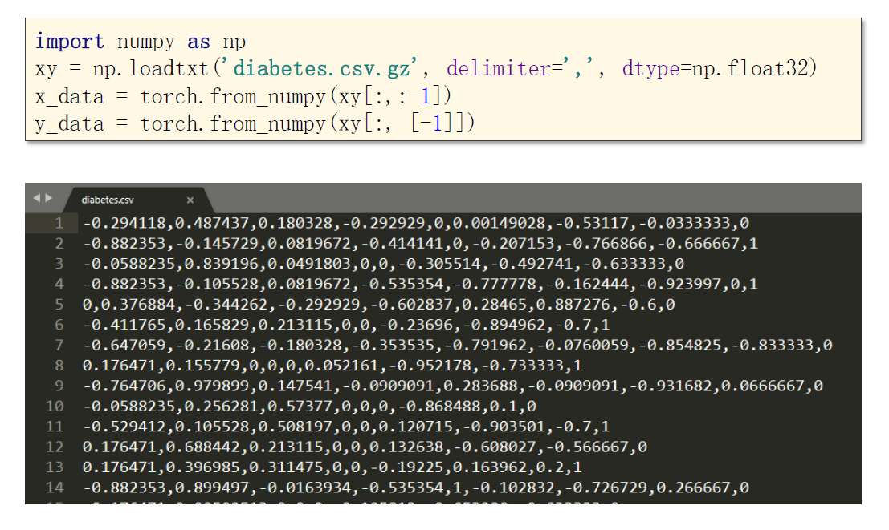

​		Dataset是一个抽象类，我们需要继承并实现它。并且我们需要重写 \_\_getitem\_\_ 和 \_\_len\_\_方法，len方法用于在调用len(...)时，返回这个数据集的数据量。

​		对于 init 方法，有两种实现思路，一种是一口气把全部数据读进来，另一种是只进行初始化，数据在之后要用的时候再读入（用多少读多少）。后者的应用场景是数据量很大，内存可能存不下的情况。

​		DataLoader构造方法中的 num_workers 表示读取数据时使用的线程数。


 ## 代码示例

代码功能：Dataset的一个具体实现，以及如果遍历DataLoader


## 一个注意事项

​		在Windows下启用多线程需要用检查一下当前线程是否为主线程。

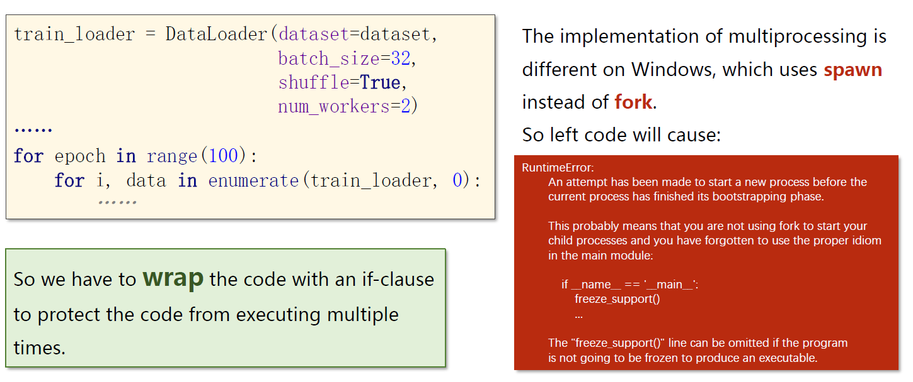


# 多分类问题

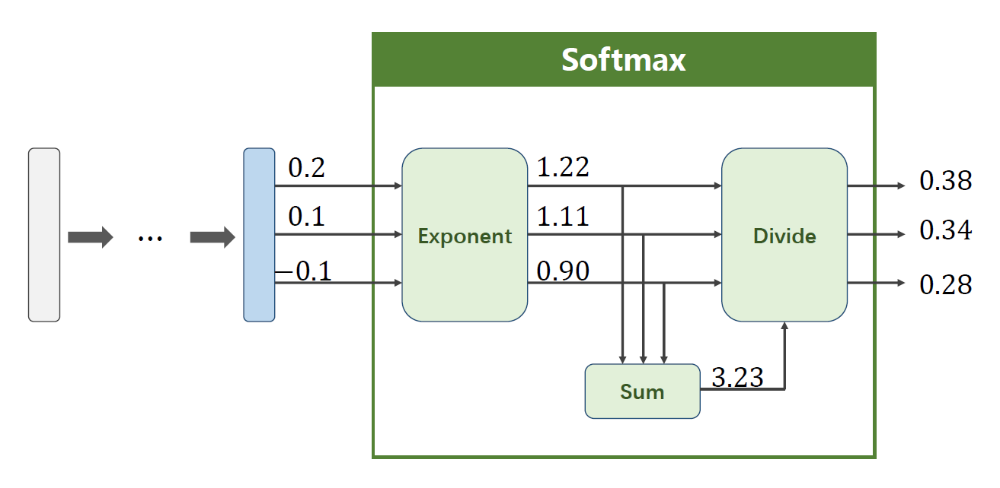

 		在pytorch中实现softmax模块时需要注意，CrossEntropyLoss直接把后面一整块都给封装了，因此传给这个模块的值是不需要激活的，直接传线性值即可！同时要注意 y 应该为 LongTensor。

 

 ## 代码示例

代码功能：通过一个5层全连接神经网络，演示 Torch.nn.CrossEntropyLoss 的用法。

* 这里的 Y_pred 都是没有激活过的
* 关于 Tensor 的 view 方法的使用请参考[官方文档](https://pytorch-cn.readthedocs.io/zh/latest/package_references/Tensor/#viewargs-tensor)

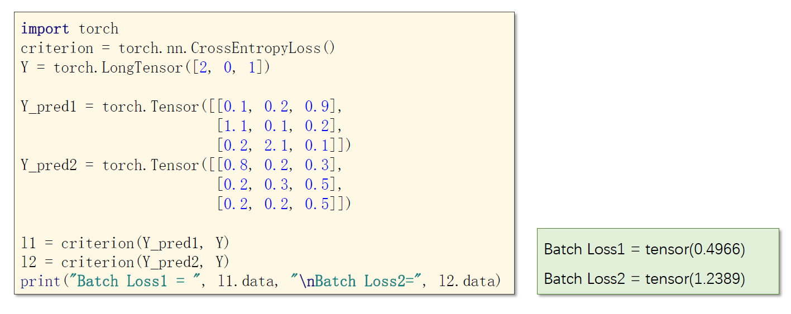

```python
import torch
import torchvision
import numpy as np
import matplotlib.pyplot as plt
from torch.utils.data import Dataset
from torch.utils.data import DataLoader

####################### Part1. Prepare Dataset #######################

batch_size = 64

# 依次执行其中的transform
# 1. 将PIL图像转为Pytorch的Tensor，图像张量的形状一般为(m,W*H*C)，但在pytorch中是(m,C*W*H)
# 2. 将输入参数归一化，使其均值为0，标准差为1
# 其中，0.1307是整个mnist数据集的均值，0.3081是整个mnist数据集的标准差
transform = torchvision.transforms.Compose([
    torchvision.transforms.ToTensor(),
    torchvision.transforms.Normalize(0.1307, 0.3081)
])

x_train = torchvision.datasets.MNIST(root="D:/Drafts/mnist", train=True, download=True, transform=transform)
train_loader = DataLoader(x_train, shuffle=True, batch_size=batch_size)

x_test = torchvision.datasets.MNIST(root="D:/Drafts/mnist", train=False, download=True, transform=transform)
test_loader = DataLoader(x_test, shuffle=False, batch_size=batch_size)


####################### Part2. Design Model #######################

class MyModule(torch.nn.Module):
    def __init__(self):
        super(MyModule, self).__init__()
        self.l1 = torch.nn.Linear(784, 512)
        self.l2 = torch.nn.Linear(512, 256)
        self.l3 = torch.nn.Linear(256, 128)
        self.l4 = torch.nn.Linear(128, 64)
        self.l5 = torch.nn.Linear(64, 10)
        self.activate = torch.nn.ReLU()

    def forward(self, x):
        # 类似于np.array的reshape，-1表示根据其他维数来推算这一维
        x = x.view(-1, 784)
        x = self.activate(self.l1(x))
        x = self.activate(self.l2(x))
        x = self.activate(self.l3(x))
        x = self.activate(self.l4(x))
        # 使用的损失函数是CrossEntropyLoss，因此最后一步不要激活
        x = self.l5(x)
        return x


model = MyModule()

####################### Part3. Construct Loss and Optimizer #######################

criterion = torch.nn.CrossEntropyLoss()
optimizer = torch.optim.Adam(model.parameters(), lr=0.01)


def train():
    cost_total = 0
    for i, data in enumerate(train_loader):
        inputs, labels = data

        y_pred = model(inputs)

        cost = criterion(y_pred, labels)
        cost_total += cost.item()

        optimizer.zero_grad()
        cost.backward()
        optimizer.step()

    return cost_total


####################### Part4. Train and Test #######################

def test():
    correct = 0
    total = 0

    with torch.no_grad():
        for i, data in enumerate(test_loader):
            inputs, labels = data

            y_pred = model(inputs)
            _, outputs = torch.max(y_pred.data, dim=1)

            # np.array用shape看各维度的维数，torch.Tensor用size看各维度的维数
            total += labels.size(0)
            correct += (outputs == labels).sum().item()

    print("test accuracy:", correct / total)


if __name__ == "__main__":
    for epoch in range(10):
        train()
        test() # 最终的准确率大致是96%
```

# 卷积神经网络

* 图中的 Subsampling（下采样）其实就是池化层。注意池化层的 stride 一般和 size 一样大。


​		在吴恩达的深度学习课程中，提到过过滤器的通道数必须和输入的通道数一致。这里补充一点，过滤器的各个通道中的参数是可以不一样的。具体参考下图：


## 代码示例1

代码功能：演示 pytorch 中的卷积层和池化层

* 这里的 kernel_size 也可以是一个元组，比如 (5,3) ，但是一般而言都是用正方形的过滤器的。
* Conv2d 构造器的更多参数可以参考[官方文档](https://pytorch-cn.readthedocs.io/zh/latest/package_references/torch-nn/) 
  * 常见的参数主要有：padding、bias、stride等


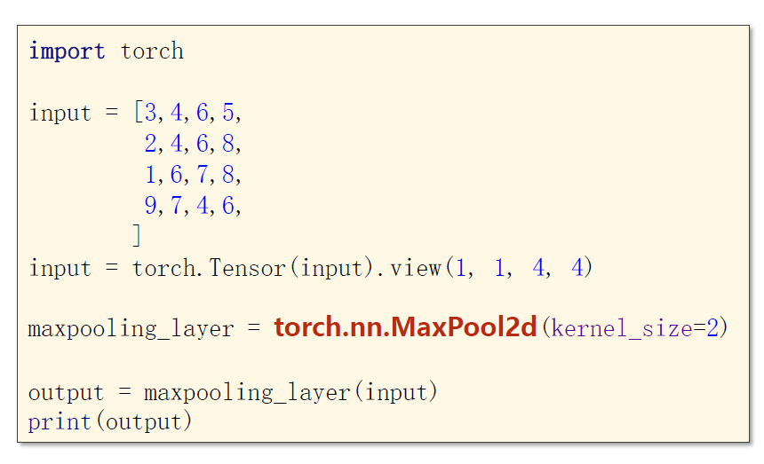

## 代码示例2

代码功能：基于CNN的 mnist 数据集训练

```python
import torch
import torchvision
from torch.utils.data import DataLoader

####################### Part1. Prepare Dataset #######################

batch_size = 128

transform = torchvision.transforms.Compose([
    torchvision.transforms.ToTensor(),
    torchvision.transforms.Normalize(0.1307, 0.3081)
])

x_train = torchvision.datasets.MNIST(root="D:/Drafts/mnist", train=True, transform=transform, download=False)
train_loader = DataLoader(x_train, batch_size=batch_size, shuffle=True, num_workers=2)

x_test = torchvision.datasets.MNIST(root="D:/Drafts/mnist", train=False, transform=transform, download=False)
test_loader = DataLoader(x_test, batch_size=batch_size, shuffle=False, num_workers=2)


####################### Part2. Design Model #######################

class MyModule(torch.nn.Module):
    def __init__(self):
        super(MyModule, self).__init__()
        self.conv1 = torch.nn.Conv2d(1, 10, 5)
        self.pool1 = torch.nn.MaxPool2d(2)
        self.conv2 = torch.nn.Conv2d(10, 20, 5)
        self.pool2 = torch.nn.MaxPool2d(2)
        self.fc1 = torch.nn.Linear(320, 10)
        self.activate = torch.nn.ReLU()

    def forward(self, x):
        # x的初始形状为 (batch,1,28,28)
        x = self.activate(self.conv1(x))
        x = self.activate(self.pool1(x))
        x = self.activate(self.conv2(x))
        x = self.activate(self.pool2(x))
        # x的当前形状为 (batch,20,4,4)
        x = x.view(-1, 20 * 4 * 4)
        x = self.fc1(x)
        return x


model = MyModule()

# 启用GPU进行模型训练，cude:0 表示使用本机的第0块显卡
# 注：一台电脑可以配备多块显卡
device = torch.device("cude:0" if torch.cuda.is_available() else "cpu")
model.to(device)

####################### Part3. Construct Loss and Optimizer #######################

criterion = torch.nn.CrossEntropyLoss()
optimizer = torch.optim.Adam(model.parameters(), lr=0.01)


####################### Part4. Train and Test #######################

def train():
    loss_total = 0

    for batch_index, data in enumerate(train_loader):
        inputs, labels = data
        # 启用GPU进行模型训练，须使用和前一步一样的显卡
        inputs, labels = inputs.to(device), labels.to(device)

        y_pred = model(inputs)
        loss = criterion(y_pred, labels)
        optimizer.zero_grad()
        loss.backward()
        optimizer.step()

        loss_total += loss.item()

    return loss_total


def test():
    correct = 0
    total = 0

    with torch.no_grad():
        for data in test_loader:
            inputs, labels = data
            # 启用GPU进行模型训练，须使用和前几步一样的显卡
            inputs, labels = inputs.to(device), labels.to(device)

            y_pred = model(inputs)
            _, outputs = torch.max(y_pred, dim=1)

            total += outputs.size(0)
            correct += (outputs == labels).sum().item()

    print("test accuracy:", 100 * correct / total)


if __name__ == "__main__":
    for epoch in range(5):
        print("<----- %d ----->" % epoch)
        train()
        test() # 最终的准确率大致是98%
```

# 卷积神经网络-高级

​		下图所示的是GoogleNet，这是一个很常用的神经网络基础架构。在实现这一基础架构时，可以先实现 Inception Module 等模块，然后再拼接这个大模块。

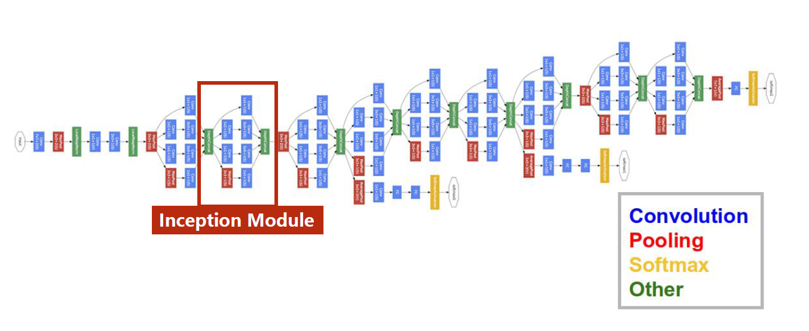

​		这里的 Inception Module是这门课程给出的，和吴恩达深度学习课程中给出的不太一样。但都需要注意的一点是，各个分支最后得到的输出，他们的宽高必须能匹配上。至于各自的通道数是多少，这个没有规定，反正都能拼接上。

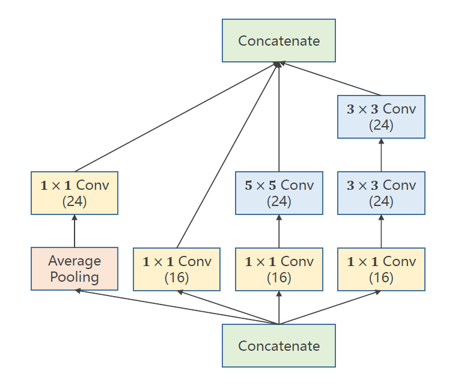

​		在实现神经网络时需要注意，并不是越层数越多越好，下图的数据就证明了这一点。造成这一现象的原因有：过拟合、梯度消失等诸多原因。当然，这只是对于 PlainNet 而言的，对于 ResNet，那就是多多益善了。

​		在 pytorch 中实现 ResNet 时，其实就是在 identity block 或 convolutional block中把返回值改成 x + x_0 即可。

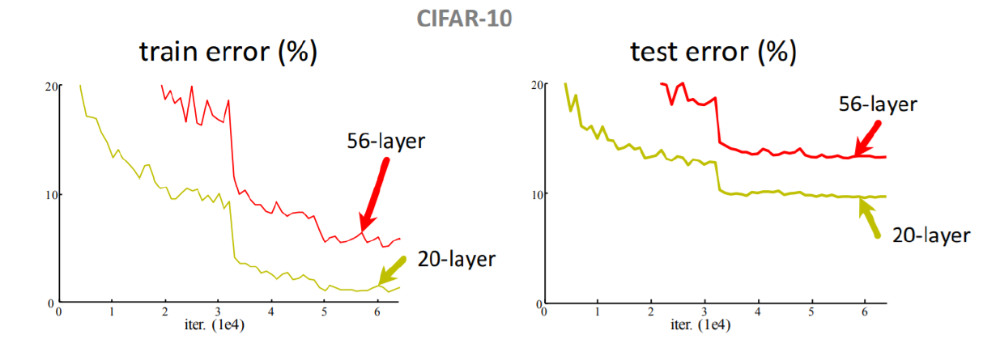

## 代码示例1

代码功能：实现了上图中的 Inception Module


* 最后的线性单元的输入是1408维的，来源如下：
  * 通道变化过程：10 ==> 88 ==> 20 ==> 88 ==> 展开得到输入为1408维的向量。其中，1408 = 4\*4\*88，4\*4是最终输出的图像的宽和高。
  * 注意这里使用的 mnist 数据集。
  * 注意这里 Net 模块中 forward 方法中的 view 的用法，in_size 是输入数据集的规模，通过保留规模，自动算出展开后应有的维数。实践中不需要自己去算，就把 init 中最后几行代码略去，然后在 forward 中把维数输出出来看一眼就行了。


## 代码示例2

代码功能：基于 ResNet 的 mnist 数据集训练

* skip over 2层的 identity block，也可以加上 NormBatch
* 实现时，可以在每一步检查一下输出的张量的 size 是否和期望的一样


```python
import torch
import torchvision
import numpy as np
import matplotlib.pyplot as plt
from torch.utils.data import Dataset
from torch.utils.data import DataLoader

####################### Part1. Prepare Dataset #######################

batch_size = 128

transform = torchvision.transforms.Compose([
    torchvision.transforms.ToTensor(),
    torchvision.transforms.Normalize(0.1307, 0.3081)
])

x_train = torchvision.datasets.MNIST(root="D:/Drafts/mnist", train=True, transform=transform, download=False)
train_loader = DataLoader(x_train, batch_size=batch_size, shuffle=True, num_workers=2)

x_test = torchvision.datasets.MNIST(root="D:/Drafts/mnist", train=False, transform=transform, download=False)
test_loader = DataLoader(x_test, batch_size=batch_size, shuffle=False, num_workers=2)


####################### Part2. Design Model #######################

# 这里实现的其实是一个卷积块，不过实践中也不必太纠结这个
class IdentityBlock(torch.nn.Module):
    def __init__(self, in_channels, out_channels):
        super(IdentityBlock, self).__init__()
        self.conv1 = torch.nn.Conv2d(in_channels, in_channels, kernel_size=3, padding=1)
        self.conv2 = torch.nn.Conv2d(in_channels, out_channels, kernel_size=3, padding=1)
        # 用于统一x和y的通道数，最好不要复用conv2，参数单独训练
        self.conv = torch.nn.Conv2d(in_channels, out_channels, kernel_size=3, padding=1)
        self.activate = torch.nn.ReLU()

    def forward(self, x):
        y = self.activate(self.conv1(x))
        y = self.conv2(y)
        x = self.conv(x)
        return self.activate(x + y)


class MyModule(torch.nn.Module):
    def __init__(self):
        super(MyModule, self).__init__()
        self.r1 = IdentityBlock(1, 10)
        self.p1 = torch.nn.MaxPool2d(2)
        self.r2 = IdentityBlock(10, 20)
        self.p2 = torch.nn.MaxPool2d(2)
        self.fc = torch.nn.Linear(20 * 7 * 7, 10)
        self.activate = torch.nn.ReLU()

    def forward(self, x):
        x = self.r1(x)
        x = self.activate(self.p1(x))
        x = self.r2(x)
        x = self.activate(self.p2(x))
        x = x.view(-1, 20 * 7 * 7)
        x = self.fc(x)
        return x


model = MyModule()

####################### Part3. Construct Loss and Optimizer #######################

criterion = torch.nn.CrossEntropyLoss()
optimizer = torch.optim.Adam(model.parameters(), lr=0.01)


####################### Part4. Train and Test #######################

def train():
    for (inputs, labels) in train_loader:
        y_pred = model(inputs)
        loss = criterion(y_pred, labels)
        optimizer.zero_grad()
        loss.backward()
        optimizer.step()

def test():
    correct = 0
    total = 0
    with torch.no_grad():
        for (inputs, labels) in test_loader:
            y_pred = model(inputs)
            _, outputs = torch.max(y_pred, dim=1)

            total += labels.size(0)
            correct += (outputs == labels).sum().item()

    print("test accuracy:", correct / total)


if __name__ == "__main__":
    for epoch in range(10):
        print("<----- %d ----->" % epoch)
        train()
        test() # 最终的准确率大致是98%
```

# 循环神经网络

​		下图是RNN基本单元的一个结构图，这个图和吴恩达深度学习中介绍的是一样的，只不过在深度学习课程中，我们假设输出的是一个多分类（one-hot向量），因此输出直接走softmax了，而这里而没有对输出进行明确假设。

​		<font style="color:red">input_size</font> 和 <font style="color:red">hidden_size</font> 分别表示<font style="color:red">输入参数</font>和<font style="color:red">隐藏参数</font>的维度。使用时直接 hidden = cell( input, hidden ) 即可。


​		具体的使用方式如下：

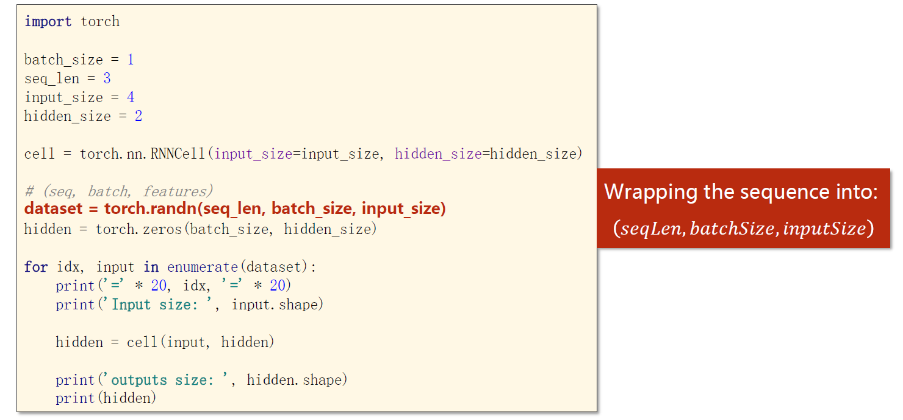

​		在使用 PyTorch 实现具有多层结构的 RNN 时，我们可以直接指定层数 num_layers，inputs就是下面整个的 x 序列，而 hidden 就是左边的h0，注意这里左侧和右侧的h其实都是 (num_layers, hidden_size) 的向量。

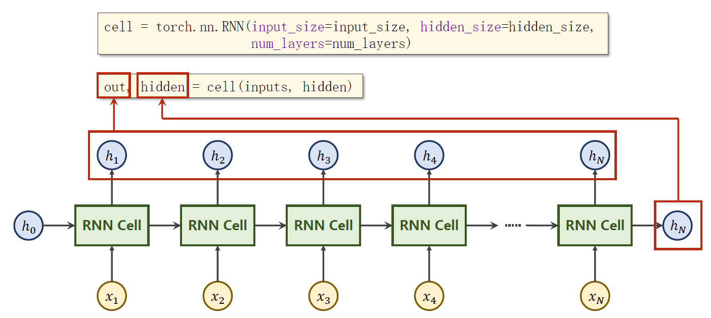

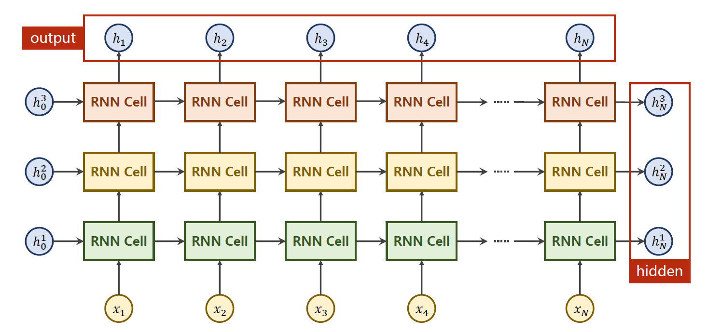

​		具体使用方式如下，注意这里对 inputs 的维度要求是第一维是序列长度。


​		有时为了方便构造数据集，也会把 batch_size 放在第一个，序列长度放在第二个。


​		LSTM模块和GRU模块的用法也差不多，详情参考[LSTM](https://pytorch-cn.readthedocs.io/zh/latest/package_references/torch-nn/#class-torchnnlstm-args-kwargssource)和[GRU](https://pytorch-cn.readthedocs.io/zh/latest/package_references/torch-nn/#class-torchnngru-args-kwargssource)的官方文档。

## 其他内容

​		假设现在希望训练一个RNN模型，学习 hello ==> ohlol 的变化规律。首先就得考虑数据要怎么存储才能输入给这个神经网络。其中一种方式就是建立字典，然后将单词存储在 one-hot 向量中。


​		将单词转化为 one-hot 向量的代码示例，同时需要注意调整 Tensor 的维度。


## Embedding层

​		one-hot 方式具有维度高、稀疏、硬编码的缺点，为此引入 embedding 层来表示字符串。embedding 具有维度低，稠密，可学习等优点。其基本思想是将高维稀疏的 one-hot 映射至一个稠密的低纬的空间中，其实就是常说的数据降维。

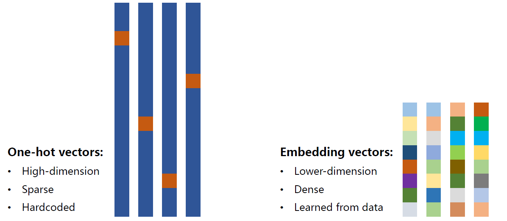

​		以后在我们的神经网络中，就引入一层 Embedding 层，将 one-hot 向量转为稠密表示。


​		关于 Embedding 层的详细用法请参考[官方文档](https://pytorch-cn.readthedocs.io/zh/latest/package_references/torch-nn/#sparse-layers)。

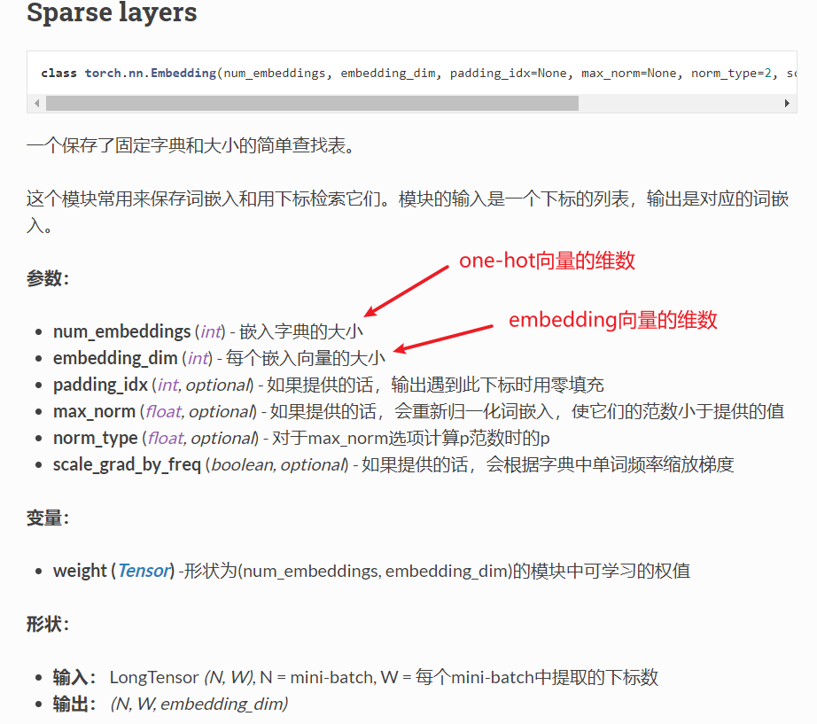

## 代码示例1

代码功能：使用RNNCell和RNN学习 hello ==> ohlol

* 使用RNNCell
  * 注意RNNCell一次只能处理一个序列中的一个字符。
  * labels 的 shape 是 (seqLen, 1)
  * 注意在一个数据集中，各个数据的输入序列长度可能是不一样的。此时需要做填充。


* 使用RNN
  * labels 的 shape 是 (seqLen*batchSize, 1)，这里最好也 view 成 (-1, 1)

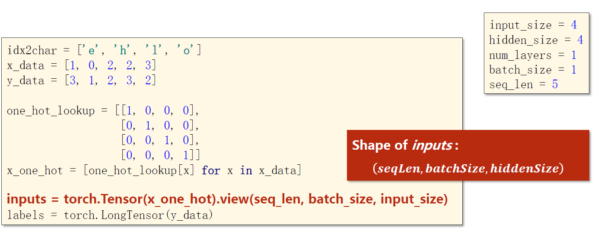


## 代码示例2

代码功能：实现一个增加了 embedding 层的RNN

* 这里一定要注意 x_data 和 y_data 的维数！

```python
import torch

####################### Part1. Prepare Dataset #######################

dictionary = ['e', 'h', 'l', 'o']
# 注意这里并没有真的用one-hot向量来表示
x_data = [[1, 0, 2, 2, 3]]  # hello
y_data = [3, 1, 2, 3, 2]  # ohlol

inputs = torch.LongTensor(x_data)
labels = torch.LongTensor(y_data)

num_class = len(dictionary)  # 字典的长度
inputs_size = num_class  # 输入的维数，不是batch_size
hidden_size = 8  # 隐藏层的维数
embedding_size = 10  # embedding向量的维数，即将one-hot压缩（扩大）至几维
num_layers = 2  # RNN的层数
batch_size = 1  # batch_size，这里只有1组数据，所以取1
seq_len = len(x_data)  # 输入序列的长度，如果各数据输入序列长度不同，则取最大值

print(inputs.size()) # torch.Size([1, 5])，即[batchSize, seqLen]
print(labels.size()) # torch.Size([5])，即[batchSize * seqLen]


####################### Part2. Design Model #######################

class MyModule(torch.nn.Module):
    def __init__(self):
        super(MyModule, self).__init__()
        self.emb = torch.nn.Embedding(inputs_size, embedding_size)
        self.rnn = torch.nn.RNN(input_size=embedding_size,
                                hidden_size=hidden_size,
                                num_layers=num_layers,
                                batch_first=True)
        self.fc = torch.nn.Linear(hidden_size, num_class)

    def forward(self, x):
        # hidden的形状为(num_layers * num_directions, batchSize, hidden_size)
        # hidden其实就是每个元素对应的记忆细胞，所以是每组数据都要有自己的，不能共用别人的
        hidden = torch.zeros(num_layers, x.size(0), hidden_size)
        x = self.emb(x)  # 输入值形状为(batchSize, seqLen), 输出值形状为(batchSize, seqLen, embeddingSize)
        x, _ = self.rnn(x, hidden)  # 输出值形状为(batchSize, seqLen, hiddenSize)
        							# 注意这里的返回值是(output, h_n)，详情参考官方文档
        x = self.fc(x)  # 输出值形状为(batchSize, seqLen, numClass)
        return x.view(-1, num_class)  # reshape是为了维度和labels匹配，然后使用CrossEntropy损失函数


model = MyModule()

####################### Part3. Construct Loss and Optimizer #######################

criterion = torch.nn.CrossEntropyLoss()
optimizer = torch.optim.Adam(model.parameters(), lr=0.01)

####################### Part4. Train and Test #######################

for epoch in range(15):
    y_pred = model(inputs)
    loss = criterion(y_pred, labels)
    optimizer.zero_grad()
    loss.backward()
    optimizer.step()

    # 返回输入张量给定维度上每行的最大值，并同时返回每个最大值的位置索引
    _, index = y_pred.max(dim=1)
    index = index.data.numpy()
    print("Predicted:", "".join([dictionary[x] for x in index]), end="")
    print(", Epoch [%d/15] loss = %.3f" % (epoch + 1, loss.item()))
```

# 循环神经网络-高级

​		在 pytorch 中可以通过将RNN、GRU或LSTM模块的 bidirectional 属性置为 True 实现双向RNN。


## 代码示例

代码功能：基于RNN的 names 数据集训练，即输入名字，输出这个名字所属的国家

* 神经网络结构，注意这里是用最终生成的隐藏节点去计算最终的输出值，而不是用每步的输出值来计算。

  

* 单词词典直接使用ASCII码即可，在将字符串转为向量时通过padding来统一长度。

  

  

* 国家词典

  

```python
import csv
import gzip
import torch
import torchvision
import numpy as np
import matplotlib.pyplot as plt
from torch.utils.data import Dataset
from torch.utils.data import DataLoader

####################### Part1. Prepare Dataset #######################

BEDDING_SIZE = 100
HIDDEN_SIZE = 100
BATCH_SIZE = 256
N_LAYER = 2  # 使用2层GRU
N_EPOCHS = 100  # 训练100轮
N_CHARS = 128  # ASCII码表中有128个字符


class NameDataset(Dataset):
    def __init__(self, is_train_set=True):
        # 通过csv和gzip包从.gz文件中读取.csv文件的数据
        fileName = "D:\\Dataset\\ForLearning\\names_train.csv.gz" if is_train_set else "D:\\Dataset\\ForLearning\\names_test.csv.gz"
        with gzip.open(fileName, 'rt') as f:
            reader = csv.reader(f)
            rows = list(reader)
        # 获取数据集，names即inputs，countries即labels
        self.names = [row[0] for row in rows]
        self.len = len(self.names)
        self.countries = [row[1] for row in rows]
        self.country_list = list(sorted(set(self.countries)))
        self.country_dict = self.getCountryDict()
        self.country_num = len(self.country_list)

    def __getitem__(self, item):
        return self.names[item], self.country_dict[self.countries[item]]

    def __len__(self):
        return self.len

    def getCountryDict(self):
        country_dict = dict()
        for index, country_name in enumerate(self.country_list, 0):
            country_dict[country_name] = index
        return country_dict

    def indexToCountry(self, index):
        return self.country_list[index]

    def getCountriesNum(self):
        return self.country_num


trainSet = NameDataset(is_train_set=True)
train_loader = DataLoader(trainSet, batch_size=BATCH_SIZE, shuffle=True)
testSet = NameDataset(is_train_set=False)
test_loader = DataLoader(testSet, batch_size=BATCH_SIZE, shuffle=False)

N_COUNTRY = trainSet.getCountriesNum()


####################### Part2. Design Model #######################

# 实现前向传播的过程中，如果对维数有疑问，可以查阅官方文档中对返回值shape的说明
class MyModule(torch.nn.Module):
    def __init__(self, input_size, embedding_size, hidden_size, num_layers, bidirectional, output_size):
        super(MyModule, self).__init__()
        self.num_directions = 2 if bidirectional else 1

        self.embedding = torch.nn.Embedding(input_size, embedding_size)
        self.gru = torch.nn.GRU(input_size=embedding_size,
                                hidden_size=hidden_size,
                                num_layers=num_layers,
                                bidirectional=bidirectional)
        self.fc = torch.nn.Linear(hidden_size * self.num_directions, output_size)

    def forward(self, x):
        # print("x =", x)
        # print("at first:", x.size())
        x = self.embedding(x)
        # print("after embedding:", x.size())
        _, x = self.gru(x)

        # RNN可能有好几层，当为单向RNN时，我们取最后一层的隐藏节点
        # 当为双向RNN时，我们取最后一层的两个方向隐藏节点，并按行方向（左右）拼接在一起
        if self.num_directions == 2:
            x = torch.cat([x[-1], x[-1]], dim=-1)
        else:
            x = x[-1]

        # print("after gru:", x.size())
        x = self.fc(x)
        # print("after fc:", x.size())
        return x.view(-1, N_COUNTRY)


# model = MyModule(N_CHARS, BEDDING_SIZE, HIDDEN_SIZE, N_LAYER, False, N_COUNTRY)
model = MyModule(N_CHARS, BEDDING_SIZE, HIDDEN_SIZE, N_LAYER, True, N_COUNTRY)

####################### Part3. Construct Loss and Optimizer #######################

criterion = torch.nn.CrossEntropyLoss()
optimizer = torch.optim.Adam(model.parameters(), lr=0.001)


####################### Part4. Train and Test #######################

# 为数据集做填充，使得每组数据的输入序列一样长
# 这里的maxLen是每个batch内的maxLen，不是整个数据集的maxLen
# 比如["ABCD","BCD"]转为[[65,66,67,68],[66,67,68,0]]
def fix(matrix, maxLen):
    for row in matrix:
        assert len(row) <= maxLen
        for i in range(len(row), maxLen):
            row.append(0)
    return matrix

# 将字符串转为ASCII编码，比如["ABCD","BCD"]转为[[65,66,67,68],[66,67,68]]
def names_to_matrix(names):
    matrix = []
    maxLen = -1
    for name in names:
        row = []
        maxLen = max(maxLen, len(name))
        for ch in name:
            row.append(ord(ch))
        matrix.append(row)

    # 填充使得全部输入的序列长度相同
    matrix = fix(matrix, maxLen)
    # 转置是为了将形状调整为(seqLen, batchSize)
    return np.transpose(matrix)


def train():
    for (names, countries) in train_loader:
        names = names_to_matrix(names)
        names = torch.LongTensor(names)
        countries = torch.LongTensor(countries)

        y_pred = model(names)
        # print(y_pred.size(), countries.size())
        loss = criterion(y_pred, countries)
        optimizer.zero_grad()
        loss.backward()
        optimizer.step()


def test(current_epoch):
    correct = 0
    total = 0
    with torch.no_grad():
        for (names, countries) in test_loader:
            names = names_to_matrix(names)
            names = torch.LongTensor(names)
            countries = torch.LongTensor(countries)

            y_pred = model(names)
            _, index = y_pred.max(dim=1)

            correct += (index == countries).sum().item()
            total += countries.size(0)
    accuracy = correct / total
    print(current_epoch, "test accuracy:", accuracy)
    return  accuracy


if __name__ == "__main__":
    accuracy_list = []
    for epoch in range(30):
        train()
        accuracy_list.append(test(epoch+1))

    plt.plot(accuracy_list)
    plt.xlabel("epoch")
    plt.ylabel("accuracy")
    plt.show()
```

* 为了加速GRU的计算，可以将输入按照实际长度降序排序，然后压缩

  * 第二张图的映射并不完全准确，只是示意图

  

  

* pack_padded_sequence 的功能大致就是如图所示，将各个列都叠在一起，且只保留非零部分。但是要求原向量各列的实际长度按照降序排列。详细内容可以参考[官方文档](https://pytorch-cn.readthedocs.io/zh/latest/package_references/torch-nn/#torchnnutilsrnnpack_padded_sequenceinput-lengths-batch_firstfalsesource)。

  

 # torchvision中的训练集

* 详细内容请参考[官方文档](https://pytorch-cn.readthedocs.io/zh/latest/torchvision/torchvision-datasets/)


 
